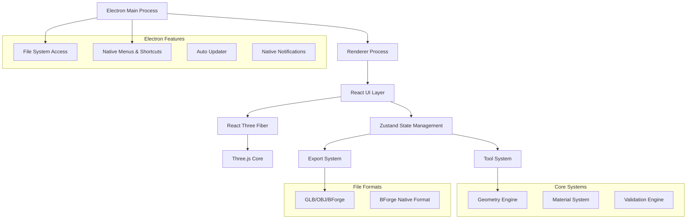
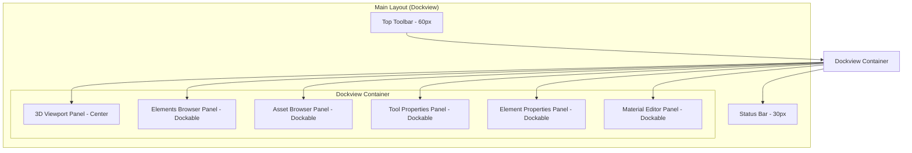

# تصميم Building Forge

## نظرة عامة

Building Forge هي أداة تصميم معماري ثلاثي الأبعاد مكتبية مبنية بالكامل على TypeScript باستخدام Electron، مخصصة لإنشاء مباني محسنة للألعاب. تستخدم الأداة React Three Fiber كجسر بين React و Three.js، مما يوفر تجربة تطوير declarative مع أداء عالي للرسم ثلاثي الأبعاد.

كتطبيق Electron مكتبي، توفر Building Forge:
- أداء محسن للعمليات ثلاثية الأبعاد المعقدة
- وصول كامل لنظام الملفات لإدارة المشاريع والأصول
- دعم اختصارات النظام والقوائم الأصلية
- إمكانيات تصدير واستيراد متقدمة
- عمل بدون اتصال إنترنت

التصميم يركز على الأداء والقابلية للصيانة من خلال استخدام TypeScript strict mode، وأنماط معمارية واضحة، ونظام إدارة حالة محسن باستخدام Zustand.

## المعمارية

### البنية العامة



### طبقات النظام

1. **طبقة Electron الأساسية (Electron Layer)**
   - العملية الرئيسية (Main Process) لإدارة النوافذ والنظام
   - عملية العرض (Renderer Process) للواجهة
   - وصول آمن لنظام الملفات
   - قوائم وإشعارات أصلية للنظام

2. **طبقة واجهة المستخدم (UI Layer)**
   - مكونات React مع TypeScript
   - React Three Fiber للعرض ثلاثي الأبعاد
   - واجهات تفاعلية للأدوات والخصائص

3. **طبقة إدارة الحالة (State Layer)**
   - Zustand stores مع TypeScript interfaces
   - إدارة حالة الأدوات والعناصر والمشروع
   - نظام undo/redo متقدم

4. **طبقة المنطق الأساسي (Core Logic Layer)**
   - نظام الأدوات القابل للتوسع
   - محرك الهندسة للعمليات ثلاثية الأبعاد
   - نظام المواد والنسيج

5. **طبقة التصدير والاستيراد (I/O Layer)**
   - مصدرات GLB/OBJ محسنة للألعاب
   - نظام BForge للمشاريع الأصلية
   - ضغط وتحسين الأصول

## معمارية Electron

### العملية الرئيسية (Main Process)

```typescript
// src/main/main.ts
import { app, BrowserWindow, Menu, dialog, ipcMain } from 'electron';
import { autoUpdater } from 'electron-updater';
import path from 'path';

class BuildingForgeApp {
  private mainWindow: BrowserWindow | null = null;
  
  constructor() {
    this.setupApp();
    this.setupIPC();
    this.setupAutoUpdater();
  }
  
  private setupApp(): void {
    app.whenReady().then(() => {
      this.createMainWindow();
      this.setupNativeMenus();
    });
    
    app.on('window-all-closed', () => {
      if (process.platform !== 'darwin') {
        app.quit();
      }
    });
  }
  
  private createMainWindow(): void {
    this.mainWindow = new BrowserWindow({
      width: 1400,
      height: 900,
      minWidth: 1200,
      minHeight: 700,
      webPreferences: {
        nodeIntegration: false,
        contextIsolation: true,
        preload: path.join(__dirname, 'preload.js'),
        webSecurity: true
      },
      titleBarStyle: 'hiddenInset', // macOS
      frame: process.platform !== 'win32', // Windows custom frame
      show: false
    });
    
    // تحميل التطبيق
    if (process.env.NODE_ENV === 'development') {
      this.mainWindow.loadURL('http://localhost:5173');
      this.mainWindow.webContents.openDevTools();
    } else {
      this.mainWindow.loadFile(path.join(__dirname, '../renderer/index.html'));
    }
    
    // عرض النافذة عند الاستعداد
    this.mainWindow.once('ready-to-show', () => {
      this.mainWindow?.show();
    });
  }
  
  private setupNativeMenus(): void {
    const template: Electron.MenuItemConstructorOptions[] = [
      {
        label: 'ملف',
        submenu: [
          {
            label: 'مشروع جديد',
            accelerator: 'CmdOrCtrl+N',
            click: () => this.handleNewProject()
          },
          {
            label: 'فتح مشروع',
            accelerator: 'CmdOrCtrl+O',
            click: () => this.handleOpenProject()
          },
          {
            label: 'حفظ',
            accelerator: 'CmdOrCtrl+S',
            click: () => this.handleSaveProject()
          },
          { type: 'separator' },
          {
            label: 'تصدير',
            submenu: [
              {
                label: 'تصدير GLB',
                click: () => this.handleExport('glb')
              },
              {
                label: 'تصدير OBJ',
                click: () => this.handleExport('obj')
              }
            ]
          }
        ]
      },
      {
        label: 'تحرير',
        submenu: [
          {
            label: 'تراجع',
            accelerator: 'CmdOrCtrl+Z',
            click: () => this.sendToRenderer('undo')
          },
          {
            label: 'إعادة',
            accelerator: 'CmdOrCtrl+Y',
            click: () => this.sendToRenderer('redo')
          },
          { type: 'separator' },
          {
            label: 'نسخ',
            accelerator: 'CmdOrCtrl+C',
            click: () => this.sendToRenderer('copy')
          },
          {
            label: 'لصق',
            accelerator: 'CmdOrCtrl+V',
            click: () => this.sendToRenderer('paste')
          }
        ]
      },
      {
        label: 'أدوات',
        submenu: [
          {
            label: 'تحديد',
            accelerator: 'V',
            click: () => this.sendToRenderer('tool:select')
          },
          {
            label: 'جدار',
            accelerator: 'W',
            click: () => this.sendToRenderer('tool:wall')
          },
          {
            label: 'أرضية',
            accelerator: 'F',
            click: () => this.sendToRenderer('tool:floor')
          },
          {
            label: 'باب',
            accelerator: 'D',
            click: () => this.sendToRenderer('tool:door')
          },
          {
            label: 'نافذة',
            accelerator: 'Shift+W',
            click: () => this.sendToRenderer('tool:window')
          }
        ]
      }
    ];
    
    const menu = Menu.buildFromTemplate(template);
    Menu.setApplicationMenu(menu);
  }
  
  private setupIPC(): void {
    // معالجة طلبات حفظ الملفات
    ipcMain.handle('save-project', async (event, projectData: BForgeProject) => {
      const result = await dialog.showSaveDialog(this.mainWindow!, {
        filters: [
          { name: 'Building Forge Projects', extensions: ['bforge'] }
        ],
        defaultPath: `${projectData.metadata.name}.bforge`
      });
      
      if (!result.canceled && result.filePath) {
        const fs = await import('fs/promises');
        await fs.writeFile(result.filePath, JSON.stringify(projectData));
        return { success: true, filePath: result.filePath };
      }
      
      return { success: false };
    });
    
    // معالجة طلبات فتح الملفات
    ipcMain.handle('open-project', async () => {
      const result = await dialog.showOpenDialog(this.mainWindow!, {
        filters: [
          { name: 'Building Forge Projects', extensions: ['bforge'] }
        ],
        properties: ['openFile']
      });
      
      if (!result.canceled && result.filePaths.length > 0) {
        const fs = await import('fs/promises');
        const data = await fs.readFile(result.filePaths[0], 'utf-8');
        return { success: true, data: JSON.parse(data) };
      }
      
      return { success: false };
    });
    
    // معالجة طلبات تصدير الملفات
    ipcMain.handle('export-model', async (event, data: ArrayBuffer, format: string) => {
      const extensions = { glb: ['glb'], obj: ['obj'] };
      const result = await dialog.showSaveDialog(this.mainWindow!, {
        filters: [
          { name: `${format.toUpperCase()} Files`, extensions: extensions[format as keyof typeof extensions] }
        ]
      });
      
      if (!result.canceled && result.filePath) {
        const fs = await import('fs/promises');
        await fs.writeFile(result.filePath, Buffer.from(data));
        return { success: true, filePath: result.filePath };
      }
      
      return { success: false };
    });
  }
  
  private sendToRenderer(channel: string, data?: any): void {
    this.mainWindow?.webContents.send(channel, data);
  }
  
  private async handleNewProject(): Promise<void> {
    this.sendToRenderer('menu:new-project');
  }
  
  private async handleOpenProject(): Promise<void> {
    this.sendToRenderer('menu:open-project');
  }
  
  private async handleSaveProject(): Promise<void> {
    this.sendToRenderer('menu:save-project');
  }
  
  private async handleExport(format: string): Promise<void> {
    this.sendToRenderer('menu:export', { format });
  }
}

new BuildingForgeApp();
```

### طبقة Preload الآمنة

```typescript
// src/main/preload.ts
import { contextBridge, ipcRenderer } from 'electron';

// واجهة آمنة للتواصل مع العملية الرئيسية
const electronAPI = {
  // عمليات الملفات
  saveProject: (projectData: BForgeProject) => 
    ipcRenderer.invoke('save-project', projectData),
  
  openProject: () => 
    ipcRenderer.invoke('open-project'),
  
  exportModel: (data: ArrayBuffer, format: string) => 
    ipcRenderer.invoke('export-model', data, format),
  
  // الاستماع لأحداث القوائم
  onMenuAction: (callback: (action: string, data?: any) => void) => {
    ipcRenderer.on('menu:new-project', () => callback('new-project'));
    ipcRenderer.on('menu:open-project', () => callback('open-project'));
    ipcRenderer.on('menu:save-project', () => callback('save-project'));
    ipcRenderer.on('menu:export', (_, data) => callback('export', data));
    ipcRenderer.on('undo', () => callback('undo'));
    ipcRenderer.on('redo', () => callback('redo'));
    ipcRenderer.on('copy', () => callback('copy'));
    ipcRenderer.on('paste', () => callback('paste'));
    ipcRenderer.on('tool:select', () => callback('tool', { name: 'select' }));
    ipcRenderer.on('tool:wall', () => callback('tool', { name: 'wall' }));
    ipcRenderer.on('tool:floor', () => callback('tool', { name: 'floor' }));
    ipcRenderer.on('tool:door', () => callback('tool', { name: 'door' }));
    ipcRenderer.on('tool:window', () => callback('tool', { name: 'window' }));
  },
  
  // معلومات النظام
  platform: process.platform,
  
  // إشعارات النظام
  showNotification: (title: string, body: string) => {
    new Notification(title, { body });
  }
};

// تصدير الواجهة بشكل آمن
contextBridge.exposeInMainWorld('electronAPI', electronAPI);

// تعريف الأنواع للـ TypeScript
declare global {
  interface Window {
    electronAPI: typeof electronAPI;
  }
}
```

### خدمة Electron في React

```typescript
// src/renderer/services/ElectronService.ts
class ElectronService {
  private isElectron: boolean;
  
  constructor() {
    this.isElectron = typeof window !== 'undefined' && window.electronAPI;
    this.setupMenuListeners();
  }
  
  private setupMenuListeners(): void {
    if (!this.isElectron) return;
    
    window.electronAPI.onMenuAction((action: string, data?: any) => {
      switch (action) {
        case 'new-project':
          this.handleNewProject();
          break;
        case 'open-project':
          this.handleOpenProject();
          break;
        case 'save-project':
          this.handleSaveProject();
          break;
        case 'export':
          this.handleExport(data.format);
          break;
        case 'undo':
          useBuildingStore.getState().undo();
          break;
        case 'redo':
          useBuildingStore.getState().redo();
          break;
        case 'tool':
          useBuildingStore.getState().setActiveTool(data.name);
          break;
      }
    });
  }
  
  async saveProject(project: BForgeProject): Promise<boolean> {
    if (!this.isElectron) {
      // fallback للمتصفح
      this.downloadFile(JSON.stringify(project), `${project.metadata.name}.bforge`);
      return true;
    }
    
    const result = await window.electronAPI.saveProject(project);
    return result.success;
  }
  
  async openProject(): Promise<BForgeProject | null> {
    if (!this.isElectron) {
      // fallback للمتصفح
      return this.openFileDialog();
    }
    
    const result = await window.electronAPI.openProject();
    return result.success ? result.data : null;
  }
  
  async exportModel(data: ArrayBuffer, format: string): Promise<boolean> {
    if (!this.isElectron) {
      // fallback للمتصفح
      this.downloadFile(data, `model.${format}`);
      return true;
    }
    
    const result = await window.electronAPI.exportModel(data, format);
    return result.success;
  }
  
  showNotification(title: string, message: string): void {
    if (this.isElectron) {
      window.electronAPI.showNotification(title, message);
    } else {
      // fallback للمتصفح
      if ('Notification' in window) {
        new Notification(title, { body: message });
      }
    }
  }
  
  private downloadFile(data: string | ArrayBuffer, filename: string): void {
    const blob = new Blob([data]);
    const url = URL.createObjectURL(blob);
    const a = document.createElement('a');
    a.href = url;
    a.download = filename;
    a.click();
    URL.revokeObjectURL(url);
  }
  
  private async openFileDialog(): Promise<BForgeProject | null> {
    return new Promise((resolve) => {
      const input = document.createElement('input');
      input.type = 'file';
      input.accept = '.bforge';
      input.onchange = async (e) => {
        const file = (e.target as HTMLInputElement).files?.[0];
        if (file) {
          const text = await file.text();
          resolve(JSON.parse(text));
        } else {
          resolve(null);
        }
      };
      input.click();
    });
  }
}

export const electronService = new ElectronService();
```

## المكونات والواجهات

### التقنيات المستخدمة (Electron Stack)

#### Frontend Stack (TypeScript + Electron):
- **Electron 28+** للتطبيق المكتبي مع أمان محسن
- **React 18+** مع **TypeScript 5.0+** للواجهة القوية والآمنة
- **Vite** كأداة بناء مع دعم ممتاز لـ TypeScript و Electron
- **Three.js** مع **@types/three** للرسم ثلاثي الأبعاد
- **React Three Fiber (@react-three/fiber)** لدمج Three.js مع React
- **@react-three/drei** للمكونات الجاهزة
- **Zustand** لإدارة الحالة مع TypeScript
- **dockview** لنظام panels متقدم مع دعم floating windows

#### مكتبات Electron المتخصصة:
- **electron-builder** لبناء وتوزيع التطبيق
- **electron-updater** للتحديثات التلقائية
- **electron-store** لحفظ الإعدادات المحلية
- **electron-window-state** لحفظ حالة النوافذ
- **electron-context-menu** للقوائم السياقية

#### مكتبات UI المتقدمة:
- **dockview** لنظام panels قابل للتخصيص مع:
  - إعادة ترتيب panels بالسحب والإفلات
  - تغيير حجم panels ديناميكياً
  - استخراج panels كنوافذ منفصلة (popout)
  - حفظ واستعادة تخطيط الواجهة
  - دعم الشاشات المتعددة
- **three-stdlib** للأدوات الإضافية مع دعم TypeScript
- **@react-three/postprocessing** للتأثيرات البصرية
- **react-use-gesture** للتفاعل مع الماوس واللمس
- **leva** لواجهة التحكم المتقدمة
- **react-hotkeys-hook** للاختصارات

#### أدوات التطوير TypeScript + Electron:
- **TypeScript 5.0+** مع strict mode
- **ESLint** مع @typescript-eslint/parser و electron-specific rules
- **Prettier** مع دعم TypeScript
- **Vitest** للاختبار مع TypeScript
- **@types/react** و **@types/react-dom** و **@types/electron**
- **concurrently** لتشغيل العمليات المتوازية أثناء التطوير

### هيكل المشروع المحدث (Electron + TypeScript)

```
building-forge-desktop/
├── src/
│   ├── main/                    # Electron Main Process
│   │   ├── main.ts             # نقطة دخول العملية الرئيسية
│   │   ├── preload.ts          # طبقة الأمان بين العمليات
│   │   ├── menu.ts             # قوائم النظام الأصلية
│   │   ├── updater.ts          # نظام التحديثات التلقائية
│   │   └── file-handlers.ts    # معالجة الملفات والمجلدات
│   ├── renderer/               # Electron Renderer Process
│   │   ├── components/
│   │   │   ├── Viewport/
│   │   │   │   ├── Scene3D.tsx
│   │   │   │   ├── Camera.tsx
│   │   │   │   ├── Controls.tsx
│   │   │   │   └── Grid.tsx
│   │   │   ├── Sidebar/
│   │   │   │   ├── ElementsBrowser.tsx
│   │   │   │   ├── ToolPanel.tsx
│   │   │   │   ├── PropertiesPanel.tsx
│   │   │   │   └── MaterialsPanel.tsx
│   │   │   ├── Toolbar/
│   │   │   │   ├── MainToolbar.tsx
│   │   │   │   ├── ViewControls.tsx
│   │   │   │   └── ExportControls.tsx
│   │   │   ├── Dialogs/
│   │   │   │   ├── NewProjectDialog.tsx
│   │   │   │   ├── ExportDialog.tsx
│   │   │   │   └── SettingsDialog.tsx
│   │   │   └── UI/
│   │   │       ├── Modal.tsx
│   │   │       ├── Button.tsx
│   │   │       ├── Input.tsx
│   │   │       ├── Slider.tsx
│   │   │       └── ColorPicker.tsx
│   │   ├── services/
│   │   │   ├── ElectronService.ts    # خدمة التواصل مع Electron
│   │   │   ├── ProjectService.ts
│   │   │   ├── FileService.ts
│   │   │   ├── BForgeService.ts
│   │   │   └── ValidationService.ts
│   │   ├── tools/
│   │   │   ├── base/
│   │   │   │   ├── Tool.ts
│   │   │   │   ├── ToolManager.ts
│   │   │   │   └── ToolState.ts
│   │   │   ├── WallTool.ts
│   │   │   ├── FloorTool.ts
│   │   │   ├── DoorTool.ts
│   │   │   ├── WindowTool.ts
│   │   │   ├── CutTool.ts
│   │   │   └── SelectTool.ts
│   │   ├── utils/
│   │   │   ├── geometry/
│   │   │   │   ├── GeometryUtils.ts
│   │   │   │   ├── MeshGenerator.ts
│   │   │   │   └── UVMapper.ts
│   │   │   ├── materials/
│   │   │   │   ├── MaterialManager.ts
│   │   │   │   ├── PBRMaterial.ts
│   │   │   │   └── TextureLoader.ts
│   │   │   ├── export/
│   │   │   │   ├── BForgeExporter.ts
│   │   │   │   ├── BForgeImporter.ts
│   │   │   │   ├── GLBExporter.ts
│   │   │   │   ├── OBJExporter.ts
│   │   │   │   └── ExportOptimizer.ts
│   │   │   ├── math/
│   │   │   │   ├── Vector3Utils.ts
│   │   │   │   ├── GeometryMath.ts
│   │   │   │   └── Intersection.ts
│   │   │   └── validation/
│   │   │       ├── GeometryValidator.ts
│   │   │       └── ExportValidator.ts
│   │   ├── store/
│   │   │   ├── slices/
│   │   │   │   ├── projectSlice.ts
│   │   │   │   ├── toolSlice.ts
│   │   │   │   ├── materialSlice.ts
│   │   │   │   └── settingsSlice.ts
│   │   │   ├── index.ts
│   │   │   └── middleware.ts
│   │   ├── types/
│   │   │   ├── core/
│   │   │   │   ├── Building.ts
│   │   │   │   ├── Element.ts
│   │   │   │   └── Transform.ts
│   │   │   ├── geometry/
│   │   │   │   ├── Wall.ts
│   │   │   │   ├── Floor.ts
│   │   │   │   ├── Door.ts
│   │   │   │   └── Window.ts
│   │   │   ├── materials/
│   │   │   │   ├── Material.ts
│   │   │   │   ├── Texture.ts
│   │   │   │   └── PBRProperties.ts
│   │   │   ├── tools/
│   │   │   │   ├── ToolTypes.ts
│   │   │   │   ├── ToolEvents.ts
│   │   │   │   └── ToolSettings.ts
│   │   │   ├── export/
│   │   │   │   ├── ExportSettings.ts
│   │   │   │   ├── BForgeFormat.ts
│   │   │   │   └── ExportResult.ts
│   │   │   ├── electron/
│   │   │   │   ├── ElectronAPI.ts
│   │   │   │   └── IPCTypes.ts
│   │   │   └── ui/
│   │   │       ├── UIEvents.ts
│   │   │       └── ComponentProps.ts
│   │   ├── hooks/
│   │   │   ├── useElectron.ts      # هوك للتعامل مع Electron
│   │   │   ├── useThree.ts
│   │   │   ├── useTools.ts
│   │   │   ├── useExport.ts
│   │   │   ├── useImport.ts
│   │   │   ├── useBForge.ts
│   │   │   ├── useKeyboard.ts
│   │   │   ├── useMaterials.ts
│   │   │   └── useProject.ts
│   │   ├── constants/
│   │   │   ├── GameUnits.ts
│   │   │   ├── MaterialPresets.ts
│   │   │   ├── ToolSettings.ts
│   │   │   └── ExportDefaults.ts
│   │   ├── App.tsx               # مكون التطبيق الرئيسي
│   │   ├── main.tsx              # نقطة دخول React
│   │   └── index.html            # صفحة HTML الأساسية
│   └── shared/                   # كود مشترك بين العمليات
│       ├── types/
│       │   └── common.ts
│       └── constants/
│           └── app.ts
├── resources/                    # موارد التطبيق
│   ├── icons/
│   │   ├── icon.png
│   │   ├── icon.ico              # Windows
│   │   └── icon.icns             # macOS
│   ├── textures/
│   │   ├── materials/
│   │   └── ui/
│   ├── models/
│   │   └── templates/
│   └── presets/
│       ├── materials.json
│       └── rooms.json
├── build/                        # ملفات البناء
│   ├── icons/
│   └── installers/
├── dist/                         # الملفات المبنية
├── docs/
│   ├── user-guide.md
│   ├── api-reference.md
│   └── development.md
├── tests/
│   ├── main/
│   ├── renderer/
│   └── e2e/
├── electron-builder.json         # إعدادات البناء والتوزيع
├── tsconfig.json                 # إعدادات TypeScript الأساسية
├── tsconfig.main.json            # إعدادات TypeScript للعملية الرئيسية
├── tsconfig.renderer.json        # إعدادات TypeScript لعملية العرض
├── vite.config.ts                # إعدادات Vite
├── vite.main.config.ts           # إعدادات Vite للعملية الرئيسية
├── vite.renderer.config.ts       # إعدادات Vite لعملية العرض
├── eslint.config.js
└── package.json
```

#### 1. Viewport Component
```typescript
interface ViewportProps {
  scene: Scene;
  camera: Camera;
  controls: OrbitControls;
  onElementSelect: (element: BuildingElement) => void;
  onElementCreate: (element: BuildingElement) => void;
}

const Viewport: React.FC<ViewportProps> = ({
  scene,
  camera,
  controls,
  onElementSelect,
  onElementCreate
}) => {
  return (
    <Canvas camera={camera}>
      <Scene3D scene={scene} />
      <OrbitControls ref={controls} />
      <Grid />
      <Lighting />
    </Canvas>
  );
};
```

#### 2. Tool System
```typescript
abstract class BaseTool {
  abstract readonly name: string;
  abstract readonly icon: string;
  abstract readonly shortcut: string;
  
  protected isActive: boolean = false;
  protected settings: ToolSettings;
  
  abstract activate(): void;
  abstract deactivate(): void;
  abstract onMouseDown(event: MouseEvent, intersection?: Intersection): void;
  abstract onMouseMove(event: MouseEvent, intersection?: Intersection): void;
  abstract onMouseUp(event: MouseEvent, intersection?: Intersection): void;
  abstract onKeyDown(event: KeyboardEvent): void;
}

class WallTool extends BaseTool {
  readonly name = 'wall';
  readonly icon = 'wall-icon';
  readonly shortcut = 'W';
  
  private startPoint: Vector3 | null = null;
  private previewWall: Wall | null = null;
  
  onMouseDown(event: MouseEvent, intersection?: Intersection): void {
    if (intersection) {
      this.startPoint = intersection.point;
      this.createPreviewWall();
    }
  }
  
  onMouseMove(event: MouseEvent, intersection?: Intersection): void {
    if (this.startPoint && intersection && this.previewWall) {
      this.updatePreviewWall(intersection.point);
    }
  }
  
  onMouseUp(event: MouseEvent, intersection?: Intersection): void {
    if (this.startPoint && intersection) {
      this.finalizeWall(intersection.point);
      this.cleanup();
    }
  }
}
```

#### 3. State Management
```typescript
interface BuildingState {
  elements: BuildingElement[];
  selectedElements: string[];
  activeTool: string;
  materials: Material[];
  project: ProjectMetadata;
  history: HistoryState;
}

interface BuildingActions {
  addElement: (element: BuildingElement) => void;
  removeElement: (id: string) => void;
  updateElement: (id: string, updates: Partial<BuildingElement>) => void;
  selectElements: (ids: string[]) => void;
  setActiveTool: (toolName: string) => void;
  undo: () => void;
  redo: () => void;
}

const useBuildingStore = create<BuildingState & BuildingActions>((set, get) => ({
  elements: [],
  selectedElements: [],
  activeTool: 'select',
  materials: [],
  project: createDefaultProject(),
  history: createHistoryState(),
  
  addElement: (element) => set((state) => ({
    elements: [...state.elements, element],
    history: addToHistory(state.history, 'add', element)
  })),
  
  removeElement: (id) => set((state) => ({
    elements: state.elements.filter(el => el.id !== id),
    selectedElements: state.selectedElements.filter(selId => selId !== id),
    history: addToHistory(state.history, 'remove', id)
  })),
  
  updateElement: (id, updates) => set((state) => ({
    elements: state.elements.map(el => 
      el.id === id ? { ...el, ...updates } : el
    ),
    history: addToHistory(state.history, 'update', { id, updates })
  })),
  
  selectElements: (ids) => set({ selectedElements: ids }),
  
  setActiveTool: (toolName) => set({ activeTool: toolName }),
  
  undo: () => set((state) => applyUndo(state)),
  
  redo: () => set((state) => applyRedo(state))
}));
```

### نظام الأدوات المتقدم

#### Tool Manager
```typescript
class ToolManager {
  private tools: Map<string, BaseTool> = new Map();
  private activeTool: BaseTool | null = null;
  private eventListeners: Map<string, EventListener> = new Map();
  
  registerTool(tool: BaseTool): void {
    this.tools.set(tool.name, tool);
  }
  
  activateTool(name: string): void {
    if (this.activeTool) {
      this.activeTool.deactivate();
      this.removeEventListeners();
    }
    
    const tool = this.tools.get(name);
    if (tool) {
      this.activeTool = tool;
      tool.activate();
      this.setupEventListeners(tool);
    }
  }
  
  private setupEventListeners(tool: BaseTool): void {
    const mouseDownListener = (event: MouseEvent) => {
      const intersection = this.getIntersection(event);
      tool.onMouseDown(event, intersection);
    };
    
    document.addEventListener('mousedown', mouseDownListener);
    this.eventListeners.set('mousedown', mouseDownListener);
    
    // Similar setup for mousemove, mouseup, keydown
  }
}
```

## نماذج البيانات

### العناصر الأساسية

```typescript
interface Transform {
  position: Vector3;
  rotation: Euler;
  scale: Vector3;
}

interface BuildingElement {
  id: string;
  type: ElementType;
  transform: Transform;
  material: MaterialReference;
  properties: Record<string, unknown>;
  metadata: ElementMetadata;
  created: Date;
  modified: Date;
}

interface Wall extends BuildingElement {
  type: 'wall';
  startPoint: Vector3;
  endPoint: Vector3;
  height: number;
  thickness: number;
  openings: Opening[];
}

interface Floor extends BuildingElement {
  type: 'floor';
  vertices: Vector3[];
  holes: Vector3[][];
  thickness: number;
}

interface Door extends BuildingElement {
  type: 'door';
  width: number;
  height: number;
  depth: number;
  openDirection: 'left' | 'right';
  openAngle: number;
}

interface Window extends BuildingElement {
  type: 'window';
  width: number;
  height: number;
  depth: number;
  frameWidth: number;
  glassType: 'clear' | 'frosted' | 'tinted';
}
```

### نظام المواد

```typescript
interface PBRMaterial {
  id: string;
  name: string;
  albedo: Color | TextureInfo;
  metallic: number;
  roughness: number;
  normal?: TextureInfo;
  emission?: Color;
  opacity: number;
  doubleSided: boolean;
  gameEngineSettings: GameEngineSettings;
}

interface TextureInfo {
  url: string;
  repeat: Vector2;
  offset: Vector2;
  rotation: number;
  flipY: boolean;
  compression: TextureCompression;
}

interface GameEngineSettings {
  unity: UnityMaterialSettings;
  unreal: UnrealMaterialSettings;
  generic: GenericMaterialSettings;
}
```

### صيغة BForge

```typescript
interface BForgeProject {
  version: string;
  metadata: ProjectMetadata;
  building: BuildingData;
  materials: MaterialLibrary;
  settings: ProjectSettings;
  assets: AssetManifest;
  history?: ProjectHistory;
}

interface ProjectMetadata {
  id: string;
  name: string;
  description?: string;
  author: string;
  created: Date;
  modified: Date;
  version: string;
  tags: string[];
  thumbnail?: string; // base64 encoded preview
}

interface BuildingData {
  elements: BuildingElement[];
  groups: ElementGroup[];
  bounds: BoundingBox;
  units: 'unity' | 'unreal' | 'blender';
}
```

## نظام التصدير والاستيراد

### مصدر GLB محسن للألعاب

```typescript
class GameOptimizedGLBExporter {
  async export(
    building: Building, 
    settings: GameExportSettings
  ): Promise<ExportResult> {
    const scene = this.buildScene(building);
    
    // تحسين الهندسة
    const optimizedScene = await this.optimizeForGames(scene, settings);
    
    // ضغط النسيج
    const compressedTextures = await this.compressTextures(
      optimizedScene, 
      settings.textureSize
    );
    
    // تصدير GLB
    const exporter = new GLTFExporter();
    const result = await new Promise<ArrayBuffer>((resolve, reject) => {
      exporter.parse(
        optimizedScene,
        (gltf) => resolve(gltf as ArrayBuffer),
        { binary: true, includeCustomExtensions: false },
        reject
      );
    });
    
    return {
      success: true,
      data: new Blob([result], { type: 'model/gltf-binary' }),
      filename: `${building.name}.glb`,
      stats: this.calculateStats(optimizedScene),
      errors: [],
      warnings: []
    };
  }
  
  private async optimizeForGames(
    scene: Scene, 
    settings: GameExportSettings
  ): Promise<Scene> {
    const optimized = scene.clone();
    
    // دمج المضلعات المتجاورة
    this.mergeSimilarGeometries(optimized);
    
    // تبسيط الهندسة حسب مستوى الجودة
    this.simplifyGeometry(optimized, settings.quality);
    
    // إنشاء collision meshes
    if (settings.generateColliders) {
      this.generateCollisionMeshes(optimized);
    }
    
    // تحسين UV mapping
    this.optimizeUVMapping(optimized);
    
    return optimized;
  }
}
```

### مصدر BForge الأصلي

```typescript
class BForgeExporter {
  async exportProject(
    building: Building, 
    settings: BForgeExportSettings
  ): Promise<Blob> {
    const project: BForgeProject = {
      version: BFORGE_VERSION,
      metadata: this.generateMetadata(building),
      building: this.serializeBuilding(building),
      materials: this.serializeMaterials(building.materials),
      settings: this.serializeSettings(),
      assets: await this.packageAssets(settings.includeAssets),
      history: settings.includeHistory ? this.serializeHistory() : undefined
    };

    let data = JSON.stringify(project, null, settings.compression === 'none' ? 2 : 0);
    
    if (settings.compression !== 'none') {
      data = await this.compressData(data, settings.compression);
    }

    return new Blob([data], { type: 'application/bforge' });
  }
  
  private async packageAssets(includeAssets: boolean): Promise<AssetManifest> {
    if (!includeAssets) {
      return { textures: [], materials: [], models: [] };
    }
    
    const textures = await this.embedTextures();
    const materials = await this.embedMaterials();
    
    return {
      textures,
      materials,
      models: []
    };
  }
}
```

## معالجة الأخطاء

### نظام التحقق من صحة البيانات

```typescript
class GeometryValidator {
  validateBuilding(building: Building): ValidationResult {
    const errors: ValidationError[] = [];
    const warnings: ValidationWarning[] = [];
    
    // التحقق من تداخل العناصر
    const overlaps = this.detectOverlaps(building.elements);
    if (overlaps.length > 0) {
      warnings.push({
        type: 'geometry_overlap',
        message: 'عناصر متداخلة تم اكتشافها',
        elements: overlaps,
        severity: 'warning'
      });
    }
    
    // التحقق من صحة المواد
    const materialErrors = this.validateMaterials(building.materials);
    errors.push(...materialErrors);
    
    // التحقق من حدود الحجم للألعاب
    const sizeWarnings = this.checkGameEngineLimits(building);
    warnings.push(...sizeWarnings);
    
    return {
      isValid: errors.length === 0,
      errors,
      warnings
    };
  }
  
  private detectOverlaps(elements: BuildingElement[]): ElementOverlap[] {
    const overlaps: ElementOverlap[] = [];
    
    for (let i = 0; i < elements.length; i++) {
      for (let j = i + 1; j < elements.length; j++) {
        const overlap = this.checkElementOverlap(elements[i], elements[j]);
        if (overlap) {
          overlaps.push(overlap);
        }
      }
    }
    
    return overlaps;
  }
}

class ExportValidator {
  validateForExport(
    building: Building, 
    format: ExportFormat
  ): ExportValidationResult {
    const baseValidation = new GeometryValidator().validateBuilding(building);
    const formatSpecific = this.validateForFormat(building, format);
    
    return {
      ...baseValidation,
      formatErrors: formatSpecific.errors,
      formatWarnings: formatSpecific.warnings,
      canExport: baseValidation.isValid && formatSpecific.errors.length === 0
    };
  }
  
  private validateForFormat(
    building: Building, 
    format: ExportFormat
  ): FormatValidationResult {
    switch (format) {
      case 'glb':
        return this.validateForGLB(building);
      case 'obj':
        return this.validateForOBJ(building);
      case 'bforge':
        return this.validateForBForge(building);
      default:
        throw new Error(`Unsupported export format: ${format}`);
    }
  }
}
```

### معالجة الأخطاء في الواجهة

```typescript
interface ErrorBoundaryState {
  hasError: boolean;
  error: Error | null;
  errorInfo: ErrorInfo | null;
}

class BuildingForgeErrorBoundary extends React.Component<
  React.PropsWithChildren<{}>,
  ErrorBoundaryState
> {
  constructor(props: React.PropsWithChildren<{}>) {
    super(props);
    this.state = { hasError: false, error: null, errorInfo: null };
  }

  static getDerivedStateFromError(error: Error): ErrorBoundaryState {
    return {
      hasError: true,
      error,
      errorInfo: null
    };
  }

  componentDidCatch(error: Error, errorInfo: ErrorInfo) {
    this.setState({
      error,
      errorInfo
    });
    
    // إرسال تقرير الخطأ
    this.reportError(error, errorInfo);
  }

  private reportError(error: Error, errorInfo: ErrorInfo) {
    console.error('Building Forge Error:', error);
    console.error('Error Info:', errorInfo);
    
    // يمكن إضافة خدمة تقارير الأخطاء هنا
  }

  render() {
    if (this.state.hasError) {
      return (
        <ErrorFallback 
          error={this.state.error}
          errorInfo={this.state.errorInfo}
          onRestart={() => this.setState({ hasError: false, error: null, errorInfo: null })}
        />
      );
    }

    return this.props.children;
  }
}
```

## استراتيجية الاختبار

### اختبار الوحدة (Unit Testing)

سيتم استخدام **Vitest** كإطار عمل الاختبار الأساسي مع دعم كامل لـ TypeScript:

```typescript
// tests/tools/WallTool.test.ts
import { describe, it, expect, beforeEach } from 'vitest';
import { WallTool } from '@/tools/WallTool';
import { Vector3 } from 'three';

describe('WallTool', () => {
  let wallTool: WallTool;
  
  beforeEach(() => {
    wallTool = new WallTool();
  });
  
  it('should create a wall between two points', () => {
    const startPoint = new Vector3(0, 0, 0);
    const endPoint = new Vector3(5, 0, 0);
    
    const wall = wallTool.createWall(startPoint, endPoint, {
      height: 3,
      thickness: 0.2
    });
    
    expect(wall.startPoint).toEqual(startPoint);
    expect(wall.endPoint).toEqual(endPoint);
    expect(wall.height).toBe(3);
    expect(wall.thickness).toBe(0.2);
  });
  
  it('should validate wall dimensions', () => {
    const startPoint = new Vector3(0, 0, 0);
    const endPoint = new Vector3(0, 0, 0); // نفس النقطة
    
    expect(() => {
      wallTool.createWall(startPoint, endPoint, {
        height: 3,
        thickness: 0.2
      });
    }).toThrow('Wall length must be greater than zero');
  });
});
```

### اختبار الخصائص (Property-Based Testing)

سيتم استخدام **fast-check** لاختبار الخصائص العامة:

```typescript
// tests/properties/GeometryProperties.test.ts
import { describe, it } from 'vitest';
import fc from 'fast-check';
import { WallTool } from '@/tools/WallTool';
import { Vector3 } from 'three';

describe('Geometry Properties', () => {
  const wallTool = new WallTool();
  
  it('Property 1: Wall creation preserves endpoint distances', () => {
    fc.assert(fc.property(
      fc.record({
        start: fc.record({
          x: fc.float({ min: -100, max: 100 }),
          y: fc.float({ min: 0, max: 0 }), // الجدران على مستوى الأرض
          z: fc.float({ min: -100, max: 100 })
        }),
        end: fc.record({
          x: fc.float({ min: -100, max: 100 }),
          y: fc.float({ min: 0, max: 0 }),
          z: fc.float({ min: -100, max: 100 })
        }),
        height: fc.float({ min: 0.1, max: 10 }),
        thickness: fc.float({ min: 0.01, max: 1 })
      }),
      ({ start, end, height, thickness }) => {
        const startPoint = new Vector3(start.x, start.y, start.z);
        const endPoint = new Vector3(end.x, end.y, end.z);
        
        // تجاهل الحالات التي تكون فيها النقاط متطابقة
        if (startPoint.distanceTo(endPoint) < 0.01) return true;
        
        const wall = wallTool.createWall(startPoint, endPoint, { height, thickness });
        const actualDistance = wall.startPoint.distanceTo(wall.endPoint);
        const expectedDistance = startPoint.distanceTo(endPoint);
        
        return Math.abs(actualDistance - expectedDistance) < 0.001;
      }
    ), { numRuns: 100 });
  });
});
```

### تكوين الاختبار

```typescript
// vitest.config.ts
import { defineConfig } from 'vitest/config';
import { resolve } from 'path';

export default defineConfig({
  test: {
    environment: 'jsdom',
    setupFiles: ['./tests/setup.ts'],
    globals: true,
    coverage: {
      provider: 'v8',
      reporter: ['text', 'json', 'html'],
      exclude: [
        'node_modules/',
        'tests/',
        '**/*.d.ts',
        '**/*.config.*'
      ]
    }
  },
  resolve: {
    alias: {
      '@': resolve(__dirname, './src')
    }
  }
});
```

### نهج الاختبار المزدوج

**اختبارات الوحدة** تركز على:
- أمثلة محددة وحالات حدية
- تكامل المكونات
- معالجة الأخطاء
- واجهات برمجة التطبيقات

**اختبارات الخصائص** تركز على:
- الخصائص العامة التي تنطبق على جميع المدخلات
- التحقق من الصحة عبر مدخلات عشوائية متنوعة
- اكتشاف حالات حدية غير متوقعة

**تكوين اختبارات الخصائص:**
- الحد الأدنى 100 تكرار لكل اختبار خاصية
- كل اختبار خاصية يجب أن يشير إلى خاصية التصميم المقابلة
- تنسيق العلامة: **Feature: building-forge, Property {number}: {property_text}**

## الخلاصة

تصميم Building Forge يوفر أساساً قوياً لأداة تصميم معماري احترافية مع التركيز على:

- **الأمان من خلال TypeScript**: جميع الواجهات والأنواع محددة بوضوح
- **الأداء المحسن**: استخدام React Three Fiber مع تحسينات خاصة بالألعاب
- **القابلية للصيانة**: معمارية واضحة مع فصل الاهتمامات
- **التوافق مع محركات الألعاب**: تصدير محسن لـ GLB/OBJ
- **تجربة مستخدم متقدمة**: أدوات تفاعلية وواجهة سهلة الاستخدام

النظام مصمم ليكون قابلاً للتوسع والتطوير المستقبلي مع الحفاظ على الأداء والاستقرار.

## تصميم الواجهة وتخطيط اللايأوت (Dockview)

### التخطيط العام للواجهة



### 1. شريط الأدوات العلوي (Top Toolbar)

**الأبعاد:** عرض كامل × 60px ارتفاع

**المكونات:**
```typescript
interface TopToolbarLayout {
  logo: LogoSection;           // 200px width
  mainTools: ToolSection;      // 400px width  
  viewControls: ViewSection;   // 300px width
  fileActions: FileSection;    // 200px width
  layoutControls: LayoutSection; // 150px width - جديد لـ dockview
  userMenu: UserSection;       // 100px width
}

const TopToolbar: React.FC = () => {
  return (
    <div className="top-toolbar">
      <LogoSection />
      <MainToolsSection>
        <ToolButton icon="select" shortcut="V" />
        <ToolButton icon="wall" shortcut="W" />
        <ToolButton icon="floor" shortcut="F" />
        <ToolButton icon="door" shortcut="D" />
        <ToolButton icon="window" shortcut="Shift+W" />
        <ToolButton icon="cut" shortcut="C" />
      </MainToolsSection>
      <ViewControlsSection>
        <ViewButton view="perspective" />
        <ViewButton view="top" />
        <ViewButton view="front" />
        <ViewButton view="side" />
      </ViewControlsSection>
      <FileActionsSection>
        <Button>جديد</Button>
        <Button>فتح</Button>
        <Button>حفظ</Button>
        <Button>تصدير</Button>
      </FileActionsSection>
      <LayoutControlsSection>
        <Button onClick={resetLayout}>إعادة تعيين التخطيط</Button>
        <Button onClick={saveLayout}>حفظ التخطيط</Button>
      </LayoutControlsSection>
      <UserMenuSection />
    </div>
  );
};
```

### 2. نظام Dockview المتقدم

**المكونات الأساسية:**
```typescript
import { 
  DockviewReact, 
  DockviewReadyEvent, 
  IDockviewPanelProps 
} from 'dockview';

interface DockviewLayoutProps {
  onReady: (event: DockviewReadyEvent) => void;
}

const DockviewLayout: React.FC<DockviewLayoutProps> = ({ onReady }) => {
  return (
    <DockviewReact
      className="dockview-theme-dark"
      onReady={onReady}
      defaultTabHeight={35}
      watermarkComponent={WatermarkComponent}
      rightHeaderActionsComponent={HeaderActionsComponent}
      prefixHeaderActionsComponent={PrefixHeaderActionsComponent}
      components={{
        viewport: ViewportPanel,
        assetLibrary: AssetLibraryPanel,
        toolProperties: ToolPropertiesPanel,
        elementProperties: ElementPropertiesPanel,
        materialEditor: MaterialEditorPanel,
      }}
    />
  );
};
```

### 3. تعريف Panels

#### 3.1 Viewport Panel (العارض الرئيسي)
```typescript
const ViewportPanel: React.FC<IDockviewPanelProps> = (props) => {
  return (
    <div className="viewport-panel">
      <Canvas
        camera={{ position: [10, 10, 10], fov: 50 }}
        gl={{ antialias: true, alpha: false }}
      >
        <Scene3D />
        <OrbitControls />
        <Grid />
        <Lighting />
        <TransformGizmos />
      </Canvas>
      
      <ViewportOverlay>
        <ViewCube position="top-right" />
        <NavigationControls position="bottom-right" />
        <MeasurementDisplay position="top-left" />
        <PerformanceStats position="bottom-left" />
      </ViewportOverlay>
      
      <ContextMenu />
      <TooltipSystem />
    </div>
  );
};
```

#### 3.2 Asset Library Panel (مكتبة الأصول)
```typescript
interface AssetCategory {
  id: string;
  name: string;
  icon: string;
  collapsed: boolean;
  assets: Asset3D[];
}

interface Asset3D {
  id: string;
  name: string;
  thumbnail: string;
  modelPath: string;
  category: 'doors' | 'windows' | 'stairs';
  metadata: {
    dimensions: { width: number; height: number; depth: number };
    materials: string[];
    polyCount: number;
    fileSize: number;
    dateAdded: Date;
  };
}

const AssetLibraryPanel: React.FC<IDockviewPanelProps> = (props) => {
  const [categories, setCategories] = useState<AssetCategory[]>([
    {
      id: 'doors',
      name: 'Doors, Windows and Stairs',
      icon: 'door-icon',
      collapsed: false,
      assets: []
    },
    {
      id: 'windows',
      name: 'Windows',
      icon: 'window-icon',
      collapsed: false,
      assets: []
    },
    {
      id: 'stairs',
      name: 'Stairs',
      icon: 'stairs-icon',
      collapsed: false,
      assets: []
    }
  ]);

  const [selectedCategory, setSelectedCategory] = useState<string>('doors');
  const [showImportDialog, setShowImportDialog] = useState(false);

  return (
    <div className="asset-library-panel">
      <PanelHeader title="مكتبة الأصول">
        <HeaderButton 
          icon="import" 
          tooltip="استيراد أصل ثلاثي الأبعاد"
          onClick={() => setShowImportDialog(true)}
        />
        <HeaderButton 
          icon="refresh" 
          tooltip="تحديث المكتبة"
          onClick={refreshAssetLibrary}
        />
      </PanelHeader>

      <div className="asset-categories">
        {categories.map(category => (
          <AssetCategorySection
            key={category.id}
            category={category}
            onToggleCollapse={(id) => toggleCategoryCollapse(id)}
            onAssetSelect={(asset) => handleAssetSelect(asset)}
            onAssetDelete={(assetId) => handleAssetDelete(category.id, assetId)}
          />
        ))}
      </div>

      {showImportDialog && (
        <ImportAssetDialog
          onClose={() => setShowImportDialog(false)}
          onImport={(file, category) => handleAssetImport(file, category)}
        />
      )}
    </div>
  );
};

const AssetCategorySection: React.FC<{
  category: AssetCategory;
  onToggleCollapse: (id: string) => void;
  onAssetSelect: (asset: Asset3D) => void;
  onAssetDelete: (assetId: string) => void;
}> = ({ category, onToggleCollapse, onAssetSelect, onAssetDelete }) => {
  return (
    <div className="asset-category">
      <div 
        className="category-header"
        onClick={() => onToggleCollapse(category.id)}
      >
        <ChevronIcon collapsed={category.collapsed} />
        <CategoryIcon icon={category.icon} />
        <span className="category-name">{category.name}</span>
        <span className="asset-count">({category.assets.length})</span>
      </div>

      {!category.collapsed && (
        <div className="asset-grid">
          {category.assets.map(asset => (
            <AssetThumbnail
              key={asset.id}
              asset={asset}
              onSelect={() => onAssetSelect(asset)}
              onDelete={() => onAssetDelete(asset.id)}
            />
          ))}
          
          {category.assets.length === 0 && (
            <div className="empty-category">
              <EmptyIcon />
              <span>لا توجد أصول في هذه الفئة</span>
            </div>
          )}
        </div>
      )}
    </div>
  );
};

const AssetThumbnail: React.FC<{
  asset: Asset3D;
  onSelect: () => void;
  onDelete: () => void;
}> = ({ asset, onSelect, onDelete }) => {
  const [showContextMenu, setShowContextMenu] = useState(false);

  return (
    <div 
      className="asset-thumbnail"
      onClick={onSelect}
      onContextMenu={(e) => {
        e.preventDefault();
        setShowContextMenu(true);
      }}
    >
      <div className="thumbnail-image">
        
        <div className="thumbnail-overlay">
          <PlayIcon className="preview-icon" />
        </div>
      </div>
      
      <div className="asset-info">
        <span className="asset-name" title={asset.name}>
          {asset.name}
        </span>
        <span className="asset-details">
          {asset.metadata.dimensions.width}×{asset.metadata.dimensions.height}×{asset.metadata.dimensions.depth}
        </span>
      </div>

      {showContextMenu && (
        <ContextMenu
          onClose={() => setShowContextMenu(false)}
          items={[
            { label: 'إدراج في المشهد', onClick: onSelect },
            { label: 'معاينة', onClick: () => previewAsset(asset) },
            { label: 'تعديل الخصائص', onClick: () => editAssetProperties(asset) },
            { type: 'separator' },
            { label: 'حذف', onClick: onDelete, danger: true }
          ]}
        />
      )}
    </div>
  );
};
```

#### 3.3 Import Asset Dialog
```typescript
const ImportAssetDialog: React.FC<{
  onClose: () => void;
  onImport: (file: File, category: string) => void;
}> = ({ onClose, onImport }) => {
  const [selectedFile, setSelectedFile] = useState<File | null>(null);
  const [selectedCategory, setSelectedCategory] = useState<string>('doors');
  const [assetName, setAssetName] = useState<string>('');
  const [isProcessing, setIsProcessing] = useState(false);
  const [preview, setPreview] = useState<string | null>(null);

  const handleFileSelect = async (file: File) => {
    setSelectedFile(file);
    setAssetName(file.name.replace(/\.[^/.]+$/, "")); // إزالة الامتداد
    
    // إنشاء معاينة للملف
    if (file.type.includes('model') || file.name.endsWith('.obj') || file.name.endsWith('.glb')) {
      const previewUrl = await generateModelPreview(file);
      setPreview(previewUrl);
    }
  };

  const handleImport = async () => {
    if (!selectedFile || !assetName.trim()) return;

    setIsProcessing(true);
    try {
      await onImport(selectedFile, selectedCategory);
      onClose();
    } catch (error) {
      console.error('خطأ في استيراد الأصل:', error);
    } finally {
      setIsProcessing(false);
    }
  };

  return (
    <Modal title="استيراد أصل ثلاثي الأبعاد" onClose={onClose}>
      <div className="import-dialog">
        <div className="file-selection">
          <label>اختيار الملف:</label>
          <FileDropZone
            accept=".obj,.glb,.gltf,.fbx"
            onFileSelect={handleFileSelect}
            selectedFile={selectedFile}
          />
        </div>

        {selectedFile && (
          <>
            <div className="asset-details">
              <div className="detail-row">
                <label>اسم الأصل:</label>
                <Input
                  value={assetName}
                  onChange={(e) => setAssetName(e.target.value)}
                  placeholder="أدخل اسم الأصل"
                />
              </div>

              <div className="detail-row">
                <label>الفئة:</label>
                <Select
                  value={selectedCategory}
                  onChange={(value) => setSelectedCategory(value)}
                  options={[
                    { value: 'doors', label: 'أبواب ونوافذ ودرج' },
                    { value: 'windows', label: 'نوافذ' },
                    { value: 'stairs', label: 'درج' }
                  ]}
                />
              </div>
            </div>

            {preview && (
              <div className="preview-section">
                <label>معاينة:</label>
                <div className="model-preview">
                  
                </div>
              </div>
            )}
          </>
        )}

        <div className="dialog-actions">
          <Button variant="secondary" onClick={onClose}>
            إلغاء
          </Button>
          <Button 
            variant="primary" 
            onClick={handleImport}
            disabled={!selectedFile || !assetName.trim() || isProcessing}
            loading={isProcessing}
          >
            استيراد
          </Button>
        </div>
      </div>
    </Modal>
  );
};
```

#### 3.4 Asset Management Service
```typescript
class AssetManagementService {
  private assetStore = new ElectronStore({ name: 'asset-library' });
  private assetsPath: string;

  constructor() {
    this.assetsPath = path.join(app.getPath('userData'), 'assets');
    this.ensureAssetsDirectory();
  }

  private async ensureAssetsDirectory(): Promise<void> {
    const categories = ['doors', 'windows', 'stairs'];
    
    for (const category of categories) {
      const categoryPath = path.join(this.assetsPath, category);
      await fs.ensureDir(categoryPath);
      await fs.ensureDir(path.join(categoryPath, 'models'));
      await fs.ensureDir(path.join(categoryPath, 'thumbnails'));
    }
  }

  async importAsset(file: File, category: string, name: string): Promise<Asset3D> {
    const assetId = generateUniqueId();
    const fileExtension = path.extname(file.name);
    const modelFileName = `${assetId}${fileExtension}`;
    const thumbnailFileName = `${assetId}.png`;

    // مسارات الملفات
    const modelPath = path.join(this.assetsPath, category, 'models', modelFileName);
    const thumbnailPath = path.join(this.assetsPath, category, 'thumbnails', thumbnailFileName);

    try {
      // نسخ ملف النموذج
      const buffer = await file.arrayBuffer();
      await fs.writeFile(modelPath, Buffer.from(buffer));

      // إنشاء صورة مصغرة
      const thumbnail = await this.generateThumbnail(modelPath);
      await fs.writeFile(thumbnailPath, thumbnail);

      // تحليل النموذج للحصول على المعلومات
      const metadata = await this.analyzeModel(modelPath);

      // إنشاء كائن الأصل
      const asset: Asset3D = {
        id: assetId,
        name,
        thumbnail: thumbnailPath,
        modelPath,
        category: category as any,
        metadata: {
          dimensions: metadata.dimensions,
          materials: metadata.materials,
          polyCount: metadata.polyCount,
          fileSize: file.size,
          dateAdded: new Date()
        }
      };

      // حفظ في قاعدة البيانات المحلية
      await this.saveAssetToDatabase(asset);

      return asset;
    } catch (error) {
      // تنظيف الملفات في حالة الخطأ
      await this.cleanupFailedImport(modelPath, thumbnailPath);
      throw error;
    }
  }

  async getAssetsByCategory(category: string): Promise<Asset3D[]> {
    const assets = this.assetStore.get('assets', {}) as Record<string, Asset3D[]>;
    return assets[category] || [];
  }

  async deleteAsset(assetId: string, category: string): Promise<void> {
    const assets = await this.getAssetsByCategory(category);
    const asset = assets.find(a => a.id === assetId);
    
    if (asset) {
      // حذف الملفات
      await fs.remove(asset.modelPath);
      await fs.remove(asset.thumbnail);

      // إزالة من قاعدة البيانات
      const updatedAssets = assets.filter(a => a.id !== assetId);
      await this.updateCategoryAssets(category, updatedAssets);
    }
  }

  private async generateThumbnail(modelPath: string): Promise<Buffer> {
    // استخدام Three.js لإنشاء صورة مصغرة
    const loader = new GLTFLoader();
    const scene = new THREE.Scene();
    const camera = new THREE.PerspectiveCamera(75, 1, 0.1, 1000);
    const renderer = new THREE.WebGLRenderer({ preserveDrawingBuffer: true });
    
    renderer.setSize(256, 256);
    
    try {
      const gltf = await loader.loadAsync(modelPath);
      scene.add(gltf.scene);
      
      // إعداد الإضاءة والكاميرا
      const light = new THREE.DirectionalLight(0xffffff, 1);
      light.position.set(1, 1, 1);
      scene.add(light);
      
      const ambientLight = new THREE.AmbientLight(0x404040, 0.4);
      scene.add(ambientLight);
      
      // تحديد موقع الكاميرا
      const box = new THREE.Box3().setFromObject(gltf.scene);
      const center = box.getCenter(new THREE.Vector3());
      const size = box.getSize(new THREE.Vector3());
      
      const maxDim = Math.max(size.x, size.y, size.z);
      const fov = camera.fov * (Math.PI / 180);
      let cameraZ = Math.abs(maxDim / 2 / Math.tan(fov / 2));
      
      camera.position.set(center.x, center.y, center.z + cameraZ * 1.5);
      camera.lookAt(center);
      
      // رسم المشهد
      renderer.render(scene, camera);
      
      // تحويل إلى buffer
      const canvas = renderer.domElement;
      const dataURL = canvas.toDataURL('image/png');
      const base64Data = dataURL.replace(/^data:image\/png;base64,/, '');
      
      return Buffer.from(base64Data, 'base64');
    } finally {
      renderer.dispose();
    }
  }

  private async analyzeModel(modelPath: string): Promise<{
    dimensions: { width: number; height: number; depth: number };
    materials: string[];
    polyCount: number;
  }> {
    // تحليل النموذج للحصول على المعلومات
    const loader = new GLTFLoader();
    const gltf = await loader.loadAsync(modelPath);
    
    const box = new THREE.Box3().setFromObject(gltf.scene);
    const size = box.getSize(new THREE.Vector3());
    
    const materials: string[] = [];
    let polyCount = 0;
    
    gltf.scene.traverse((child) => {
      if (child instanceof THREE.Mesh) {
        if (child.material) {
          const material = Array.isArray(child.material) ? child.material[0] : child.material;
          if (material.name && !materials.includes(material.name)) {
            materials.push(material.name);
          }
        }
        
        if (child.geometry) {
          const geometry = child.geometry;
          if (geometry.index) {
            polyCount += geometry.index.count / 3;
          } else {
            polyCount += geometry.attributes.position.count / 3;
          }
        }
      }
    });
    
    return {
      dimensions: {
        width: Math.round(size.x * 100) / 100,
        height: Math.round(size.y * 100) / 100,
        depth: Math.round(size.z * 100) / 100
      },
      materials,
      polyCount: Math.round(polyCount)
    };
  }

  private async saveAssetToDatabase(asset: Asset3D): Promise<void> {
    const assets = this.assetStore.get('assets', {}) as Record<string, Asset3D[]>;
    
    if (!assets[asset.category]) {
      assets[asset.category] = [];
    }
    
    assets[asset.category].push(asset);
    this.assetStore.set('assets', assets);
  }

  private async updateCategoryAssets(category: string, assets: Asset3D[]): Promise<void> {
    const allAssets = this.assetStore.get('assets', {}) as Record<string, Asset3D[]>;
    allAssets[category] = assets;
    this.assetStore.set('assets', allAssets);
  }

  private async cleanupFailedImport(modelPath: string, thumbnailPath: string): Promise<void> {
    try {
      await fs.remove(modelPath);
      await fs.remove(thumbnailPath);
    } catch (error) {
      console.error('خطأ في تنظيف الملفات:', error);
    }
  }
}

export const assetManagementService = new AssetManagementService();
```

#### 3.5 Asset Integration with Scene
```typescript
class AssetIntegrationService {
  async insertAssetIntoScene(asset: Asset3D, position?: THREE.Vector3): Promise<BuildingElement> {
    const loader = new GLTFLoader();
    
    try {
      const gltf = await loader.loadAsync(asset.modelPath);
      const model = gltf.scene;
      
      // تحديد الموقع
      if (position) {
        model.position.copy(position);
      }
      
      // إنشاء عنصر مبنى من الأصل
      const element: BuildingElement = {
        id: generateUniqueId(),
        type: this.mapCategoryToElementType(asset.category),
        transform: {
          position: model.position,
          rotation: model.rotation,
          scale: model.scale
        },
        material: {
          id: 'default',
          name: 'Default Material'
        },
        properties: {
          assetId: asset.id,
          assetName: asset.name,
          originalDimensions: asset.metadata.dimensions,
          isImportedAsset: true
        },
        metadata: {
          source: 'imported',
          dateCreated: new Date(),
          polyCount: asset.metadata.polyCount
        },
        created: new Date(),
        modified: new Date()
      };
      
      // إضافة إلى المشهد
      const { addElement } = useBuildingStore.getState();
      addElement(element);
      
      return element;
    } catch (error) {
      throw new Error(`فشل في إدراج الأصل: ${error.message}`);
    }
  }
  
  private mapCategoryToElementType(category: string): ElementType {
    switch (category) {
      case 'doors': return 'door';
      case 'windows': return 'window';
      case 'stairs': return 'stairs';
      default: return 'custom';
    }
  }
}

export const assetIntegrationService = new AssetIntegrationService();
```
```

#### 3.4 Tool Properties Panel
```typescript
const ToolPropertiesPanel: React.FC<IDockviewPanelProps> = (props) => {
  const { activeTool } = useBuildingStore();
  
  return (
    <div className="tool-properties-panel">
      <PanelHeader title="خصائص الأداة" />
      <ToolSettingsForm tool={activeTool} />
    </div>
  );
};
```

#### 3.5 Element Properties Panel
```typescript
const ElementPropertiesPanel: React.FC<IDockviewPanelProps> = (props) => {
  const { selectedElements } = useBuildingStore();
  
  return (
    <div className="element-properties-panel">
      <PanelHeader title="خصائص العنصر" />
      {selectedElements.length > 0 ? (
        <ElementPropertiesForm elements={selectedElements} />
      ) : (
        <EmptyState message="لم يتم تحديد أي عنصر" />
      )}
    </div>
  );
};
```

#### 3.6 Material Editor Panel
```typescript
const MaterialEditorPanel: React.FC<IDockviewPanelProps> = (props) => {
  return (
    <div className="material-editor-panel">
      <PanelHeader title="محرر المواد" />
      <MaterialEditor />
    </div>
  );
};
```

### 4. إدارة التخطيط (Layout Management)

```typescript
class DockviewLayoutManager {
  private dockview: DockviewApi | null = null;
  private layoutStore = new ElectronStore({ name: 'dockview-layout' });
  
  constructor() {
    this.setupDefaultLayout = this.setupDefaultLayout.bind(this);
    this.saveLayout = this.saveLayout.bind(this);
    this.loadLayout = this.loadLayout.bind(this);
  }
  
  onDockviewReady = (event: DockviewReadyEvent) => {
    this.dockview = event.api;
    this.setupDefaultLayout();
    this.loadSavedLayout();
  };
  
  private setupDefaultLayout(): void {
    if (!this.dockview) return;
    
    // إضافة العارض الرئيسي في المركز
    this.dockview.addPanel({
      id: 'viewport',
      component: 'viewport',
      title: 'العارض ثلاثي الأبعاد',
      position: { direction: 'within' }
    });
    
    // إضافة مكتبة الأصول على اليسار
    this.dockview.addPanel({
      id: 'asset-library',
      component: 'assetLibrary',
      title: 'مكتبة الأصول',
      position: { 
        direction: 'left',
        referencePanel: 'viewport'
      }
    });
    
    // إضافة خصائص الأداة على اليمين
    this.dockview.addPanel({
      id: 'tool-properties',
      component: 'toolProperties',
      title: 'خصائص الأداة',
      position: { 
        direction: 'right',
        referencePanel: 'viewport'
      }
    });
    
    // إضافة خصائص العنصر تحت خصائص الأداة
    this.dockview.addPanel({
      id: 'element-properties',
      component: 'elementProperties',
      title: 'خصائص العنصر',
      position: { 
        direction: 'below',
        referencePanel: 'tool-properties'
      }
    });
    
    // إضافة محرر المواد تحت خصائص العنصر
    this.dockview.addPanel({
      id: 'material-editor',
      component: 'materialEditor',
      title: 'محرر المواد',
      position: { 
        direction: 'below',
        referencePanel: 'element-properties'
      }
    });
  }
  
  saveLayout(): void {
    if (!this.dockview) return;
    
    const layout = this.dockview.toJSON();
    this.layoutStore.set('layout', layout);
    
    // إشعار المستخدم
    electronService.showNotification('تم الحفظ', 'تم حفظ تخطيط الواجهة بنجاح');
  }
  
  loadSavedLayout(): void {
    if (!this.dockview) return;
    
    const savedLayout = this.layoutStore.get('layout');
    if (savedLayout) {
      this.dockview.fromJSON(savedLayout);
    }
  }
  
  resetLayout(): void {
    if (!this.dockview) return;
    
    // إزالة جميع الـ panels
    this.dockview.clear();
    
    // إعادة إعداد التخطيط الافتراضي
    this.setupDefaultLayout();
    
    // حذف التخطيط المحفوظ
    this.layoutStore.delete('layout');
    
    electronService.showNotification('تم إعادة التعيين', 'تم إعادة تعيين تخطيط الواجهة للوضع الافتراضي');
  }
  
  // استخراج panel كنافذة منفصلة
  popoutPanel(panelId: string): void {
    if (!this.dockview) return;
    
    const panel = this.dockview.getPanel(panelId);
    if (panel) {
      // إنشاء نافذة Electron جديدة للـ panel
      this.createPopoutWindow(panel);
    }
  }
  
  private async createPopoutWindow(panel: IDockviewPanel): Promise<void> {
    // استخدام Electron IPC لإنشاء نافذة جديدة
    const result = await electronService.createPopoutWindow({
      panelId: panel.id,
      title: panel.title,
      component: panel.component,
      width: 800,
      height: 600
    });
    
    if (result.success) {
      // إزالة الـ panel من النافذة الرئيسية
      panel.api.close();
    }
  }
}

// إنشاء مثيل مدير التخطيط
export const layoutManager = new DockviewLayoutManager();
```

### 5. دعم الشاشات المتعددة

```typescript
// في العملية الرئيسية (main process)
class MultiScreenManager {
  private popoutWindows: Map<string, BrowserWindow> = new Map();
  
  async createPopoutWindow(options: PopoutWindowOptions): Promise<PopoutResult> {
    const { panelId, title, component, width, height } = options;
    
    // إنشاء نافذة جديدة
    const popoutWindow = new BrowserWindow({
      width,
      height,
      title,
      webPreferences: {
        nodeIntegration: false,
        contextIsolation: true,
        preload: path.join(__dirname, 'preload.js')
      },
      parent: this.mainWindow, // ربط بالنافذة الرئيسية
      modal: false
    });
    
    // تحميل محتوى الـ panel
    await popoutWindow.loadURL(`http://localhost:5173/popout/${component}`);
    
    // حفظ مرجع النافذة
    this.popoutWindows.set(panelId, popoutWindow);
    
    // معالجة إغلاق النافذة
    popoutWindow.on('closed', () => {
      this.popoutWindows.delete(panelId);
      // إعادة الـ panel للنافذة الرئيسية
      this.mainWindow?.webContents.send('restore-panel', { panelId, component });
    });
    
    return { success: true, windowId: popoutWindow.id };
  }
  
  closePopoutWindow(panelId: string): void {
    const window = this.popoutWindows.get(panelId);
    if (window) {
      window.close();
    }
  }
  
  getAllPopoutWindows(): BrowserWindow[] {
    return Array.from(this.popoutWindows.values());
  }
}
```

### 6. تخطيط الألوان والثيمات (Dockview)

```typescript
interface DockviewTheme {
  dockview: {
    background: '#1a1a1a';
    border: '#404040';
    tabBackground: '#2d2d2d';
    tabActiveBackground: '#0066cc';
    tabHoverBackground: '#3a3a3a';
    tabText: '#ffffff';
    tabActiveText: '#ffffff';
    headerBackground: '#2d2d2d';
    headerBorder: '#404040';
    splitterBackground: '#404040';
    splitterHover: '#0066cc';
  };
  
  panels: {
    background: '#1e1e1e';
    border: '#404040';
    text: '#ffffff';
    textSecondary: '#cccccc';
  };
}

const DockviewStyles = createGlobalStyle`
  .dockview-theme-dark {
    --dv-background-color: ${props => props.theme.dockview.background};
    --dv-border-color: ${props => props.theme.dockview.border};
    --dv-tab-background-color: ${props => props.theme.dockview.tabBackground};
    --dv-tab-active-background-color: ${props => props.theme.dockview.tabActiveBackground};
    --dv-tab-hover-background-color: ${props => props.theme.dockview.tabHoverBackground};
    --dv-tab-text-color: ${props => props.theme.dockview.tabText};
    --dv-tab-active-text-color: ${props => props.theme.dockview.tabActiveText};
    --dv-header-background-color: ${props => props.theme.dockview.headerBackground};
    --dv-header-border-color: ${props => props.theme.dockview.headerBorder};
    --dv-splitter-background-color: ${props => props.theme.dockview.splitterBackground};
    --dv-splitter-hover-background-color: ${props => props.theme.dockview.splitterHover};
  }
  
  .dockview-theme-dark .dv-panel {
    background: ${props => props.theme.panels.background};
    border: 1px solid ${props => props.theme.panels.border};
    color: ${props => props.theme.panels.text};
  }
`;
```

### 7. مكون التطبيق الرئيسي

```typescript
const App: React.FC = () => {
  return (
    <ThemeProvider theme={darkTheme}>
      <DockviewStyles />
      <div className="app-container">
        <TopToolbar />
        <DockviewLayout onReady={layoutManager.onDockviewReady} />
        <StatusBar />
      </div>
    </ThemeProvider>
  );
};
```

هذا التصميم المحدث يوفر:

### المزايا الجديدة:
1. **مرونة كاملة في التخطيط**: إعادة ترتيب وتغيير حجم الـ panels
2. **دعم الشاشات المتعددة**: استخراج panels كنوافذ منفصلة
3. **حفظ واستعادة التخطيط**: حفظ تفضيلات المستخدم
4. **واجهة احترافية**: مشابهة لبرامج التصميم المتقدمة مثل Blender و Maya
5. **تجربة مستخدم محسنة**: سهولة في التنقل والعمل مع عدة شاشات
## خصائص الصحة (Correctness Properties)

*الخاصية هي سمة أو سلوك يجب أن يكون صحيحاً عبر جميع عمليات التنفيذ الصالحة للنظام - في الأساس، بيان رسمي حول ما يجب أن يفعله النظام. تعمل الخصائص كجسر بين المواصفات المقروءة بشرياً وضمانات الصحة القابلة للتحقق آلياً.*

بناءً على تحليل معايير القبول، تم تحديد الخصائص التالية للاختبار:

### خصائص أدوات البناء

**الخاصية 1: تفعيل الأدوات**
*لأي* أداة في النظام، عند تحديدها يجب أن تصبح الأداة النشطة وتمكن وضع التفاعل الصحيح
**تتحقق من: المتطلبات 2.1, 2.3, 2.4, 2.5**

**الخاصية 2: إنشاء العناصر بالمعاملات**
*لأي* عنصر بناء، عند إنشائه بمعاملات محددة (سماكة، ارتفاع، عرض) يجب أن يتم إنشاؤه بهذه المعاملات بدقة
**تتحقق من: المتطلبات 2.2, 2.4, 2.5**

**الخاصية 3: وظائف أداة القطع**
*لأي* جدار وأي فتحة، يجب أن تتمكن أداة القطع من إنشاء الفتحة في الجدار بالأبعاد المحددة
**تتحقق من: المتطلبات 2.6**

### خصائص التحديد والتعديل

**الخاصية 4: تحديد العناصر**
*لأي* عنصر في المشهد، عند النقر عليه يجب أن يتم تحديده وإبرازه بصرياً وعرض خصائصه
**تتحقق من: المتطلبات 3.1, 3.2**

**الخاصية 5: تحويل العناصر**
*لأي* عنصر محدد، يجب أن تعمل أدوات النقل والتدوير والتحجيم بدقة مع الحفاظ على النسب عند التحجيم
**تتحقق من: المتطلبات 3.3, 3.4, 3.5**

**الخاصية 6: التحديد المتعدد**
*لأي* مجموعة من العناصر، يجب أن يعمل التحديد المتعدد والعمليات الجماعية على جميع العناصر المحددة
**تتحقق من: المتطلبات 3.6**

### خصائص نظام المواد

**الخاصية 7: معاينة المواد**
*لأي* مادة وأي عنصر محدد، عند تطبيق المادة يجب أن تظهر المعاينة فوراً على العنصر
**تتحقق من: المتطلبات 4.2**

**الخاصية 8: خصائص PBR**
*لأي* مادة PBR، يجب أن تحتوي على جميع الخصائص المطلوبة (Albedo, Normal, Roughness, Metallic) وتطبق بشكل صحيح
**تتحقق من: المتطلبات 4.3**

**الخاصية 9: إدارة UV Mapping**
*لأي* مادة مطبقة على عنصر، يجب أن يتم إدارة UV mapping تلقائياً لضمان محاذاة النسيج الصحيحة
**تتحقق من: المتطلبات 4.4**

**الخاصية 10: إنشاء وتعديل المواد المخصصة**
*لأي* مادة مخصصة، يجب أن يكون بالإمكان إنشاؤها وتعديلها وحفظها مع المشروع
**تتحقق من: المتطلبات 4.5, 4.6**

### خصائص القياس والدقة

**الخاصية 11: دعم وحدات القياس**
*لأي* وحدة قياس مدعومة (Unity, Unreal, Blender)، يجب أن تعمل التحويلات بدقة بين الوحدات
**تتحقق من: المتطلبات 5.1**

**الخاصية 12: دقة القياسات**
*لأي* مسافة في المشهد، يجب أن توفر أداة المسطرة قياسات دقيقة مع عرض الأبعاد تلقائياً
**تتحقق من: المتطلبات 5.2, 5.3**

**الخاصية 13: حسابات المساحة والحجم**
*لأي* عنصر، يجب أن تكون حسابات المساحة والحجم دقيقة رياضياً
**تتحقق من: المتطلبات 5.4**

**الخاصية 14: وظائف Snap-to-Grid**
*لأي* عنصر، عند تمكين snap-to-grid يجب أن يلتصق العنصر بنقاط الشبكة بدقة
**تتحقق من: المتطلبات 5.5**

**الخاصية 15: عرض الإحداثيات في الوقت الفعلي**
*لأي* عملية تلاعب بالعناصر، يجب أن تتحدث معلومات الإحداثيات في الوقت الفعلي
**تتحقق من: المتطلبات 5.6**

### خصائص العرض والتصور

**الخاصية 16: منظورات العرض المتعددة**
*لأي* منظور عرض (أمامي، جانبي، علوي، منظوري)، يجب أن يعرض المشهد بشكل صحيح من هذا المنظور
**تتحقق من: المتطلبات 6.1**

**الخاصية 17: الإضاءة الديناميكية**
*لأي* مشهد، يجب أن تطبق الإضاءة الديناميكية وتتحدث بشكل صحيح عند تغيير العناصر
**تتحقق من: المتطلبات 6.2**

**الخاصية 18: تبديل أوضاع العرض**
*لأي* وضع عرض (wireframe, solid)، يجب أن يتم التبديل بينها بسلاسة دون فقدان البيانات
**تتحقق من: المتطلبات 6.3**

**الخاصية 19: تحكم الكاميرا**
*لأي* عملية تنقل في الفضاء ثلاثي الأبعاد، يجب أن تعمل تحكمات الكاميرا والتكبير والتحريك بسلاسة
**تتحقق من: المتطلبات 6.4, 6.5**

### خصائص نظام المشاريع BForge

**الخاصية 20: حفظ واستعادة المشروع الكامل**
*لأي* مشروع، حفظه ثم تحميله يجب أن يستعيد الحالة الكاملة بما في ذلك العناصر والمواد والإعدادات
**تتحقق من: المتطلبات 7.1, 7.2, 7.3, 7.4, 7.5**

**الخاصية 21: ضغط المشروع**
*لأي* مشروع، عند تمكين الضغط يجب أن يقل حجم الملف مع الحفاظ على سلامة البيانات
**تتحقق من: المتطلبات 7.6**

**الخاصية 22: إدارة البيانات الوصفية**
*لأي* مشروع، يجب أن تحفظ وتستعاد البيانات الوصفية (المؤلف، تاريخ الإنشاء، الإصدار) بشكل صحيح
**تتحقق من: المتطلبات 7.7**

### خصائص التصدير للألعاب

**الخاصية 23: تصدير GLB و OBJ صالح**
*لأي* مشروع، يجب أن ينتج التصدير ملفات GLB و OBJ صالحة ومتوافقة مع محركات الألعاب
**تتحقق من: المتطلبات 8.1, 8.2**

**الخاصية 24: خيارات جودة التصدير**
*لأي* مستوى جودة (عالي، متوسط، منخفض)، يجب أن ينتج التصدير نتائج مختلفة تتناسب مع المستوى المحدد
**تتحقق من: المتطلبات 8.3**

**الخاصية 25: ضغط النسيج**
*لأي* دقة محددة للنسيج، يجب أن يتم ضغط النسيج إلى الدقة المحددة مع الحفاظ على الجودة
**تتحقق من: المتطلبات 8.4**

**الخاصية 26: تحسين المضلعات**
*لأي* نموذج، يجب أن يقلل التحسين عدد المضلعات مع الحفاظ على الجودة البصرية
**تتحقق من: المتطلبات 8.5**

**الخاصية 27: إنتاج شبكات التصادم**
*لأي* عنصر، يجب أن يتم إنتاج شبكات تصادم صحيحة ومحسنة للفيزياء
**تتحقق من: المتطلبات 8.6**

**الخاصية 28: تضمين مواد PBR**
*لأي* مادة PBR، يجب أن يتم تضمينها بشكل صحيح في الملفات المصدرة مع التوافق مع محركات الألعاب
**تتحقق من: المتطلبات 8.7**

### خصائص تحسين الأداء

**الخاصية 29: Occlusion Culling**
*لأي* عنصر غير مرئي، يجب أن يتم إخفاؤه بواسطة occlusion culling لتحسين الأداء
**تتحقق من: المتطلبات 9.1**

**الخاصية 30: Texture Atlasing**
*لأي* مجموعة من النسيج، يجب أن يتم دمجها في atlas لتقليل draw calls
**تتحقق من: المتطلبات 9.2**

**الخاصية 31: تحسين الشبكات**
*لأي* شبكة، يجب أن يتم تحسينها لأداء عرض أفضل
**تتحقق من: المتطلبات 9.3**

**الخاصية 32: Level of Detail (LOD)**
*لأي* عنصر بعيد، يجب أن يتم تطبيق LOD المناسب بناءً على المسافة
**تتحقق من: المتطلبات 9.5**

### خصائص تجربة المستخدم

**الخاصية 33: اختصارات لوحة المفاتيح القابلة للتخصيص**
*لأي* أداة أو إجراء، يجب أن تعمل اختصارات لوحة المفاتيح بشكل صحيح ويمكن تخصيصها
**تتحقق من: المتطلبات 10.1**

**الخاصية 34: نصائح الأدوات التفاعلية**
*لأي* عنصر واجهة مستخدم، يجب أن تظهر نصائح الأدوات عند التمرير فوقه
**تتحقق من: المتطلبات 10.2**

**الخاصية 35: نظام Undo/Redo متعدد المستويات**
*لأي* سلسلة من العمليات، يجب أن يعمل undo/redo بشكل صحيح لمستويات متعددة
**تتحقق من: المتطلبات 10.3**

**الخاصية 36: السحب والإفلات مع Snap-to-Grid**
*لأي* عنصر، يجب أن يعمل السحب والإفلات مع snap-to-grid بشكل صحيح
**تتحقق من: المتطلبات 10.4**

**الخاصية 37: نسخ ولصق العناصر**
*لأي* عنصر، يجب أن يتم نسخه ولصقه مع جميع خصائصه سليمة
**تتحقق من: المتطلبات 10.5**

**الخاصية 38: الحفظ التلقائي**
*لأي* فترة زمنية محددة، يجب أن يتم الحفظ التلقائي للمشروع لمنع فقدان البيانات
**تتحقق من: المتطلبات 10.6**

**الخاصية 39: قوالب الغرف**
*لأي* قالب غرفة، يجب أن يتم تحميله واستخدامه بشكل صحيح
**تتحقق من: المتطلبات 10.7**

### خصائص التحقق من صحة البيانات

**الخاصية 40: التحقق من القيود الهندسية**
*لأي* عنصر يتم إنشاؤه، يجب أن يتم رفض الهندسة غير الصالحة مع رسائل خطأ واضحة
**تتحقق من: المتطلبات 11.1**

**الخاصية 41: كشف التداخلات**
*لأي* عنصرين متداخلين، يجب أن يتم كشف التداخل وعرض تحذير
**تتحقق من: المتطلبات 11.2**

**الخاصية 42: التحقق من المواد قبل التصدير**
*لأي* عملية تصدير، يجب أن يتم التحقق من صحة جميع المواد المستخدمة
**تتحقق من: المتطلبات 11.3**

**الخاصية 43: التحقق من سلامة النموذج**
*لأي* نموذج يتم تصديره، يجب أن يتم التحقق من سلامته للتوافق مع محركات الألعاب
**تتحقق من: المتطلبات 11.4**

**الخاصية 44: كشف الأصول المفقودة**
*لأي* نسيج أو مادة مفقودة، يجب أن يتم كشفها والإبلاغ عنها مع اقتراحات للإصلاح
**تتحقق من: المتطلبات 11.5**

**الخاصية 45: تقارير الأخطاء التفصيلية**
*لأي* خطأ، يجب أن يتم إنتاج تقرير مفصل مع اقتراحات للإصلاح
**تتحقق من: المتطلبات 11.6**

### خصائص إدارة الأصول

**الخاصية 46: دعم صيغ النسيج المتعددة**
*لأي* صيغة نسيج مدعومة (PNG, JPG, TGA, EXR)، يجب أن يتم تحميلها بشكل صحيح
**تتحقق من: المتطلبات 12.2**

**الخاصية 47: إنتاج المواد التلقائي**
*لأي* نسيج يتم استيراده، يجب أن يتم إنتاج خصائص مادة مناسبة تلقائياً
**تتحقق من: المتطلبات 12.3**

**الخاصية 48: كشف وإعادة استخدام النسيج المكرر**
*لأي* نسيج مكرر، يجب أن يتم كشفه وإعادة استخدامه لتوفير الذاكرة
**تتحقق من: المتطلبات 12.4**

**الخاصية 49: خيارات ضغط النسيج**
*لأي* مستوى ضغط، يجب أن تعمل خيارات الضغط المختلفة وتنتج نتائج مناسبة
**تتحقق من: المتطلبات 12.5**

**الخاصية 50: إدارة مراجع الأصول**
*لأي* أصل يتم نقله أو إعادة تسميته، يجب أن يتم تحديث المراجع تلقائياً
**تتحقق من: المتطلبات 12.6**

## معالجة الأخطاء

### استراتيجية معالجة الأخطاء

```typescript
interface ErrorHandlingStrategy {
  validation: ValidationErrorHandler;
  runtime: RuntimeErrorHandler;
  export: ExportErrorHandler;
  recovery: ErrorRecoverySystem;
}

class ValidationErrorHandler {
  validateGeometry(element: BuildingElement): ValidationResult {
    const errors: ValidationError[] = [];
    
    // التحقق من القيود الهندسية
    if (element.type === 'wall') {
      const wall = element as Wall;
      if (wall.thickness <= 0) {
        errors.push({
          type: 'geometry',
          severity: 'error',
          message: 'سماكة الجدار يجب أن تكون أكبر من صفر',
          suggestion: 'قم بتعيين سماكة موجبة للجدار'
        });
      }
    }
    
    return { isValid: errors.length === 0, errors };
  }
  
  validateMaterials(project: BForgeProject): ValidationResult {
    const errors: ValidationError[] = [];
    
    // التحقق من المواد المفقودة
    project.building.elements.forEach(element => {
      if (!project.materials.library[element.material.id]) {
        errors.push({
          type: 'material',
          severity: 'warning',
          message: `المادة ${element.material.id} غير موجودة`,
          suggestion: 'قم بإعادة تعيين مادة صالحة للعنصر'
        });
      }
    });
    
    return { isValid: errors.length === 0, errors };
  }
}

class RuntimeErrorHandler {
  handleToolError(tool: BaseTool, error: Error): void {
    console.error(`خطأ في الأداة ${tool.name}:`, error);
    
    // إعادة تعيين الأداة إلى حالة آمنة
    tool.deactivate();
    
    // عرض رسالة خطأ للمستخدم
    this.showErrorNotification({
      title: 'خطأ في الأداة',
      message: `حدث خطأ أثناء استخدام ${tool.name}. تم إعادة تعيين الأداة.`,
      type: 'error'
    });
  }
  
  handleRenderError(error: Error): void {
    console.error('خطأ في العرض:', error);
    
    // محاولة استعادة العرض
    this.attemptRenderRecovery();
  }
}

class ExportErrorHandler {
  validateExport(project: BForgeProject, format: ExportFormat): ExportValidationResult {
    const errors: ExportError[] = [];
    const warnings: ExportWarning[] = [];
    
    // التحقق من التوافق مع الصيغة
    if (format === 'glb') {
      project.building.elements.forEach(element => {
        if (element.properties.customShader) {
          warnings.push({
            element: element.id,
            message: 'الشيدرات المخصصة قد لا تكون مدعومة في GLB',
            suggestion: 'استخدم مواد PBR قياسية للتوافق الأفضل'
          });
        }
      });
    }
    
    return { canExport: errors.length === 0, errors, warnings };
  }
}
```

### نظام الاستعادة من الأخطاء

```typescript
class ErrorRecoverySystem {
  private backupStates: Map<string, BuildingState> = new Map();
  
  createBackup(reason: string): void {
    const currentState = useBuildingStore.getState();
    this.backupStates.set(reason, { ...currentState });
  }
  
  recoverFromBackup(reason: string): boolean {
    const backup = this.backupStates.get(reason);
    if (backup) {
      useBuildingStore.setState(backup);
      return true;
    }
    return false;
  }
  
  handleCriticalError(error: CriticalError): void {
    // محاولة الاستعادة من آخر نسخة احتياطية
    if (this.recoverFromBackup('auto-save')) {
      this.showRecoveryNotification();
    } else {
      // إعادة تعيين إلى حالة افتراضية آمنة
      this.resetToSafeState();
    }
  }
}
```

## استراتيجية الاختبار

### نهج الاختبار المزدوج

يستخدم Building Forge نهج اختبار مزدوج يجمع بين:

1. **اختبارات الوحدة (Unit Tests)**: للتحقق من أمثلة محددة وحالات الحافة وشروط الخطأ
2. **اختبارات الخصائص (Property Tests)**: للتحقق من الخصائص العامة عبر جميع المدخلات

### مكتبة اختبار الخصائص

سيتم استخدام **fast-check** كمكتبة اختبار الخصائص لـ TypeScript:

```typescript
import fc from 'fast-check';

// مثال على اختبار خاصية
describe('Building Forge Properties', () => {
  test('Property 1: Tool Activation', () => {
    fc.assert(fc.property(
      fc.constantFrom('wall', 'floor', 'door', 'window', 'select'),
      (toolName) => {
        const toolManager = new ToolManager();
        toolManager.activateTool(toolName);
        
        expect(toolManager.getActiveTool()?.name).toBe(toolName);
        expect(toolManager.getActiveTool()?.isActive).toBe(true);
      }
    ), { numRuns: 100 });
  });
  
  test('Property 20: Project Save/Load Round Trip', () => {
    fc.assert(fc.property(
      generateRandomProject(),
      async (project) => {
        const exporter = new BForgeExporter();
        const importer = new BForgeImporter();
        
        // حفظ المشروع
        const blob = await exporter.exportProject(project.building, {
          compression: 'none',
          includeAssets: true,
          includeHistory: false,
          includeViewSettings: true
        });
        
        // تحميل المشروع
        const file = new File([blob], 'test.bforge');
        const loadedProject = await importer.importProject(file);
        
        // التحقق من التطابق
        expect(loadedProject.building.elements).toEqual(project.building.elements);
        expect(loadedProject.materials).toEqual(project.materials);
      }
    ), { numRuns: 50 });
  });
});

// مولدات البيانات العشوائية
const generateRandomProject = () => fc.record({
  building: fc.record({
    elements: fc.array(generateRandomElement(), { minLength: 1, maxLength: 10 }),
    groups: fc.array(generateRandomGroup()),
    bounds: generateRandomBoundingBox(),
    units: fc.constantFrom('unity', 'unreal', 'blender')
  }),
  materials: generateRandomMaterialLibrary()
});

const generateRandomElement = () => fc.oneof(
  generateRandomWall(),
  generateRandomFloor(),
  generateRandomDoor(),
  generateRandomWindow()
);
```

### تكوين اختبارات الخصائص

- **الحد الأدنى للتكرارات**: 100 تكرار لكل اختبار خاصية
- **وسم الاختبارات**: كل اختبار خاصية يجب أن يحتوي على تعليق يشير إلى الخاصية في وثيقة التصميم
- **صيغة الوسم**: `**Feature: building-forge, Property {number}: {property_text}**`

### توازن اختبارات الوحدة

- اختبارات الوحدة مفيدة للأمثلة المحددة وحالات الحافة
- تجنب كتابة الكثير من اختبارات الوحدة - اختبارات الخصائص تتعامل مع تغطية المدخلات المتنوعة
- اختبارات الوحدة يجب أن تركز على:
  - أمثلة محددة توضح السلوك الصحيح
  - نقاط التكامل بين المكونات
  - حالات الحافة وشروط الخطأ
- اختبارات الخصائص يجب أن تركز على:
  - الخصائص العامة التي تنطبق على جميع المدخلات
  - التغطية الشاملة للمدخلات من خلال العشوائية

### أمثلة على اختبارات الوحدة

```typescript
describe('Wall Tool Unit Tests', () => {
  test('should create wall with specified thickness', () => {
    const wallTool = new WallTool();
    const startPoint = new Vector3(0, 0, 0);
    const endPoint = new Vector3(5, 0, 0);
    const thickness = 0.2;
    
    const wall = wallTool.createWall(startPoint, endPoint, { thickness });
    
    expect(wall.thickness).toBe(thickness);
    expect(wall.startPoint).toEqual(startPoint);
    expect(wall.endPoint).toEqual(endPoint);
  });
  
  test('should reject invalid wall thickness', () => {
    const wallTool = new WallTool();
    const startPoint = new Vector3(0, 0, 0);
    const endPoint = new Vector3(5, 0, 0);
    
    expect(() => {
      wallTool.createWall(startPoint, endPoint, { thickness: -0.1 });
    }).toThrow('Wall thickness must be positive');
  });
});
```

هذا التصميم الشامل يوفر أساساً قوياً لبناء Building Forge كأداة تصميم معماري احترافية ومحسنة للألعاب.

### ملفات التكوين (Electron + TypeScript)

#### package.json:
```json
{
  "name": "building-forge",
  "version": "1.0.0",
  "description": "أداة تصميم معماري ثلاثي الأبعاد للألعاب",
  "main": "dist/main/main.js",
  "homepage": "./",
  "scripts": {
    "dev": "concurrently \"npm run dev:renderer\" \"npm run dev:main\"",
    "dev:renderer": "vite --config vite.renderer.config.ts",
    "dev:main": "vite --config vite.main.config.ts --mode development",
    "build": "npm run build:renderer && npm run build:main",
    "build:renderer": "vite build --config vite.renderer.config.ts",
    "build:main": "vite build --config vite.main.config.ts",
    "preview": "vite preview --config vite.renderer.config.ts",
    "electron": "electron .",
    "electron:dev": "cross-env NODE_ENV=development electron .",
    "pack": "electron-builder --dir",
    "dist": "electron-builder",
    "dist:win": "electron-builder --win",
    "dist:mac": "electron-builder --mac",
    "dist:linux": "electron-builder --linux",
    "test": "vitest",
    "test:e2e": "playwright test",
    "lint": "eslint src --ext .ts,.tsx",
    "lint:fix": "eslint src --ext .ts,.tsx --fix",
    "type-check": "tsc --noEmit"
  },
  "dependencies": {
    "@react-three/drei": "^9.88.13",
    "@react-three/fiber": "^8.15.11",
    "dockview": "^1.12.0",
    "electron-store": "^8.1.0",
    "electron-updater": "^6.1.4",
    "react": "^18.2.0",
    "react-dom": "^18.2.0",
    "three": "^0.158.0",
    "zustand": "^4.4.7"
  },
  "devDependencies": {
    "@types/react": "^18.2.43",
    "@types/react-dom": "^18.2.17",
    "@types/three": "^0.158.3",
    "@typescript-eslint/eslint-plugin": "^6.14.0",
    "@typescript-eslint/parser": "^6.14.0",
    "@vitejs/plugin-react": "^4.2.1",
    "concurrently": "^8.2.2",
    "cross-env": "^7.0.3",
    "electron": "^28.0.0",
    "electron-builder": "^24.6.4",
    "eslint": "^8.55.0",
    "eslint-plugin-electron": "^7.0.0",
    "typescript": "^5.2.2",
    "vite": "^5.0.8",
    "vite-plugin-electron": "^0.15.5",
    "vitest": "^1.0.4"
  }
}
```

#### vite.main.config.ts:
```typescript
import { defineConfig } from 'vite';
import { resolve } from 'path';

export default defineConfig({
  mode: process.env.NODE_ENV,
  root: resolve('./src/main'),
  build: {
    outDir: resolve('./dist/main'),
    lib: {
      entry: 'main.ts',
      formats: ['cjs'],
      fileName: () => 'main.js'
    },
    rollupOptions: {
      external: ['electron']
    },
    minify: process.env.NODE_ENV === 'production',
    sourcemap: process.env.NODE_ENV === 'development'
  },
  resolve: {
    alias: {
      '@shared': resolve('./src/shared')
    }
  }
});
```

#### vite.renderer.config.ts:
```typescript
import { defineConfig } from 'vite';
import react from '@vitejs/plugin-react';
import { resolve } from 'path';

export default defineConfig({
  plugins: [react()],
  root: resolve('./src/renderer'),
  build: {
    outDir: resolve('./dist/renderer'),
    emptyOutDir: true
  },
  resolve: {
    alias: {
      '@': resolve('./src/renderer'),
      '@shared': resolve('./src/shared'),
      '@/components': resolve('./src/renderer/components'),
      '@/types': resolve('./src/renderer/types'),
      '@/utils': resolve('./src/renderer/utils'),
      '@/hooks': resolve('./src/renderer/hooks'),
      '@/store': resolve('./src/renderer/store'),
      '@/services': resolve('./src/renderer/services')
    }
  },
  optimizeDeps: {
    include: ['three', '@react-three/fiber', '@react-three/drei']
  },
  server: {
    port: 5173
  }
});
```

### مزايا تطبيق Electron

#### الأداء والإمكانيات:
- **وصول كامل لنظام الملفات**: حفظ وفتح المشاريع بدون قيود المتصفح
- **أداء محسن**: عدم وجود قيود المتصفح على الذاكرة والمعالجة
- **قوائم أصلية**: قوائم النظام مع اختصارات لوحة المفاتيح الأصلية
- **إشعارات النظام**: إشعارات أصلية للنظام
- **تحديثات تلقائية**: نظام تحديث تلقائي آمن

#### الأمان:
- **Context Isolation**: عزل كامل بين العمليات
- **Preload Scripts**: طبقة آمنة للتواصل بين العمليا��
- **Node Integration**: معطل في عملية العرض للأمان
- **CSP Headers**: حماية من XSS attacks

#### التوزيع:
- **Multi-platform**: دعم Windows, macOS, Linux
- **Auto-updater**: تحديثات تلقائية آمنة
- **Code Signing**: توقيع الكود للثقة والأمان
- **Installers**: مثبتات أصلية لكل نظام تشغيل

## الخلاصة المحدثة

Building Forge كتطبيق Electron مكتبي مع نظام dockview المتقدم سيوفر:

### الميزات الأساسية:
- **أداء فائق** للعمليات ثلاثية الأبعاد المعقدة
- **تجربة مستخدم أصلية** مع قوائم وإشعارات النظام
- **وصول كامل للملفات** لإدارة المشاريع والأصول
- **أمان محسن** مع عزل العمليات
- **توزيع سهل** عبر منصات متعددة
- **تحديثات تلقائية** لضمان أحدث الميزات

### الميزات المتقدمة مع Dockview:
- **تخطيط مرن بالكامل**: إعادة ترتيب وتغيير حجم جميع الـ panels بالسحب والإفلات
- **دعم الشاشات المتعددة**: استخراج أي panel كنافذة منفصلة للعمل على شاشات متعددة
- **حفظ واستعادة التخطيط**: حفظ تفضيلات المستخدم لتخطيط الواجهة
- **واجهة احترافية**: تجربة مشابهة لبرامج التصميم المتقدمة مثل Blender و Maya و 3ds Max
- **مرونة في العمل**: إمكانية تخصيص الواجهة حسب نوع المشروع أو تفضيلات المستخدم
- **تحسين الإنتاجية**: عرض عدة panels في نفس الوقت على شاشات مختلفة

### سيناريوهات الاستخدام المحسنة:
1. **العمل على شاشة واحدة**: تخطيط مرن مع إمكانية تغيير حجم الـ panels حسب الحاجة
2. **العمل على شاشتين**: استخراج panels الثانوية للشاشة الثانية والتركيز على العارض الرئيسي
3. **العمل على شاشات متعددة**: توزيع panels مختلفة على شاشات متعددة لأقصى إنتاجية
4. **مشاركة الشاشة**: استخراج panels محددة لمشاركتها في الاجتماعات أو العروض التقديمية

التركيز على Electron + TypeScript + Dockview سيجعل الأداة احترافية وقوية ومرنة لمطوري الألعاب.
### هيكل مجلدات الأصول

```
userData/assets/
├── doors/
│   ├── models/
│   │   ├── door-001.glb
│   │   ├── door-002.obj
│   │   └── door-003.fbx
│   ├── thumbnails/
│   │   ├── door-001.png
│   │   ├── door-002.png
│   │   └── door-003.png
│   └── metadata.json
├── windows/
│   ├── models/
│   │   ├── window-001.glb
│   │   ├── window-002.obj
│   │   └── window-003.fbx
│   ├── thumbnails/
│   │   ├── window-001.png
│   │   ├── window-002.png
│   │   └── window-003.png
│   └── metadata.json
└── stairs/
    ├── models/
    │   ├── stairs-001.glb
    │   ├── stairs-002.obj
    │   └── stairs-003.fbx
    ├── thumbnails/
    │   ├── stairs-001.png
    │   ├── stairs-002.png
    │   └── stairs-003.png
    └── metadata.json
```

### CSS Styling للـ Asset Library

```css
.asset-library-panel {
  height: 100%;
  display: flex;
  flex-direction: column;
  background: #1e1e1e;
}

.asset-categories {
  flex: 1;
  overflow-y: auto;
  padding: 8px;
}

.asset-category {
  margin-bottom: 16px;
}

.category-header {
  display: flex;
  align-items: center;
  padding: 8px 12px;
  background: #2d2d2d;
  border-radius: 4px;
  cursor: pointer;
  user-select: none;
  transition: background-color 0.2s;
}

.category-header:hover {
  background: #3a3a3a;
}

.category-header .chevron-icon {
  margin-right: 8px;
  transition: transform 0.2s;
}

.category-header .chevron-icon.collapsed {
  transform: rotate(-90deg);
}

.category-name {
  flex: 1;
  color: #ffffff;
  font-weight: 500;
}

.asset-count {
  color: #cccccc;
  font-size: 12px;
}

.asset-grid {
  display: grid;
  grid-template-columns: repeat(auto-fill, minmax(120px, 1fr));
  gap: 8px;
  padding: 8px 0;
}

.asset-thumbnail {
  background: #2d2d2d;
  border-radius: 4px;
  overflow: hidden;
  cursor: pointer;
  transition: all 0.2s;
  border: 2px solid transparent;
}

.asset-thumbnail:hover {
  border-color: #0066cc;
  transform: translateY(-2px);
  box-shadow: 0 4px 12px rgba(0, 102, 204, 0.3);
}

.thumbnail-image {
  position: relative;
  width: 100%;
  height: 80px;
  overflow: hidden;
}

.thumbnail-image img {
  width: 100%;
  height: 100%;
  object-fit: cover;
}

.thumbnail-overlay {
  position: absolute;
  top: 0;
  left: 0;
  right: 0;
  bottom: 0;
  background: rgba(0, 0, 0, 0.5);
  display: flex;
  align-items: center;
  justify-content: center;
  opacity: 0;
  transition: opacity 0.2s;
}

.asset-thumbnail:hover .thumbnail-overlay {
  opacity: 1;
}

.preview-icon {
  color: white;
  font-size: 24px;
}

.asset-info {
  padding: 8px;
}

.asset-name {
  display: block;
  color: #ffffff;
  font-size: 12px;
  font-weight: 500;
  white-space: nowrap;
  overflow: hidden;
  text-overflow: ellipsis;
  margin-bottom: 4px;
}

.asset-details {
  color: #cccccc;
  font-size: 10px;
}

.empty-category {
  grid-column: 1 / -1;
  display: flex;
  flex-direction: column;
  align-items: center;
  justify-content: center;
  padding: 32px;
  color: #666666;
  text-align: center;
}

.import-dialog {
  width: 500px;
  max-width: 90vw;
}

.file-selection {
  margin-bottom: 16px;
}

.file-drop-zone {
  border: 2px dashed #666666;
  border-radius: 8px;
  padding: 32px;
  text-align: center;
  cursor: pointer;
  transition: all 0.2s;
}

.file-drop-zone:hover,
.file-drop-zone.drag-over {
  border-color: #0066cc;
  background: rgba(0, 102, 204, 0.1);
}

.asset-details {
  margin-bottom: 16px;
}

.detail-row {
  display: flex;
  align-items: center;
  margin-bottom: 12px;
}

.detail-row label {
  width: 100px;
  color: #cccccc;
  font-size: 14px;
}

.preview-section {
  margin-bottom: 16px;
}

.model-preview {
  width: 200px;
  height: 200px;
  border: 1px solid #404040;
  border-radius: 4px;
  overflow: hidden;
}

.model-preview img {
  width: 100%;
  height: 100%;
  object-fit: cover;
}

.dialog-actions {
  display: flex;
  justify-content: flex-end;
  gap: 8px;
  margin-top: 16px;
}
```

## الخلاصة النهائية المحدثة

Building Forge كتطبيق Electron مكتبي مع نظام dockview المتقدم ومكتبة الأصول الذكية سيوفر:

### الميزات الأساسية:
- **أداء فائق** للعمليات ثلاثية الأبعاد المعقدة
- **تجربة مستخدم أصلية** مع قوائم وإشعارات النظام
- **وصول كامل للملفات** لإدارة المشاريع والأصول
- **أمان محسن** مع عزل العمليات
- **توزيع سهل** عبر منصات متعددة
- **تحديثات تلقائية** لضمان أحدث الميزات

### الميزات المتقدمة مع Dockview:
- **تخطيط مرن بالكامل**: إعادة ترتيب وتغيير حجم جميع الـ panels بالسحب والإفلات
- **دعم الشاشات المتعددة**: استخراج أي panel كنافذة منفصلة للعمل على شاشات متعددة
- **حفظ واستعادة التخطيط**: حفظ تفضيلات المستخدم لتخطيط الواجهة
- **واجهة احترافية**: تجربة مشابهة لبرامج التصميم المتقدمة مثل Blender و Maya و 3ds Max

### نظام إدارة الأصول المتقدم:
- **مكتبة أصول منظمة**: تصنيف الأصول حسب النوع (أبواب، نوافذ، درج)
- **استيراد ذكي**: استيراد نماذج ثلاثية الأبعاد مع إنشاء صور مصغرة تلقائياً
- **تحليل تلقائي**: تحليل النماذج للحصول على الأبعاد وعدد المضلعات والمواد
- **إدارة ملفات محسنة**: تنظيم الملفات في مجلدات منفصلة مع نظام metadata
- **معاينة فورية**: عرض الأصول مع صور مصغرة وتفاصيل فنية
- **سحب وإفلات**: إدراج الأصول في المشهد بسهولة

### سيناريوهات الاستخدام المحسنة:
1. **بناء مكتبة أصول مخصصة**: استيراد وتنظيم الأصول الخاصة بالمشروع
2. **العمل مع فرق متعددة**: مشاركة مكتبات الأصول بين أعضاء الفريق
3. **مشاريع متخصصة**: إنشاء مكتبات أصول مخصصة لأنواع مختلفة من الألعاب
4. **إعادة الاستخدام**: استخدام الأصول عبر مشاريع متعددة
5. **التطوير السريع**: بناء مستويات بسرعة باستخدام أصول جاهزة

التركيز على Electron + TypeScript + Dockview + نظام إدارة الأصول المتقدم سيجعل Building Forge أداة احترافية شاملة ومرنة لمطوري الألعاب.